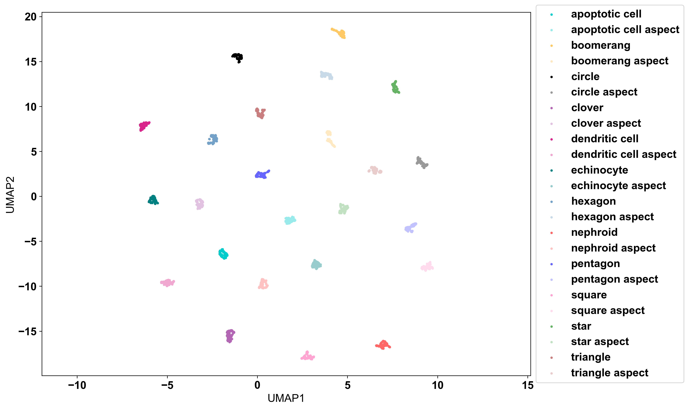

# MO2GP Project
**Morphology O(2)-invariant General-purpose Projection (MO2GP)** is a shape embedding that is invariant to rotation, reflection, scale, and translation. This pipeline uses initial shape contours, applies a Fourier transform to compute magnitude features, and performs dimensionality reduction to obtain the most informative representations. It is suitable for large-scale morphological datasets. The pipeline is implemented in a Python environment and run using Jupyter Notebook.<br>

## 📥 How to Install

You can install **MO2GP** either directly from GitHub or by cloning the repository for development.

### **Option 1 — Install Directly from GitHub**
Use `pip` to install the latest version from the `main` branch:

```bash
pip install git+https://github.com/Ijoanito/MO2GP.git
```

### **Option 2 — Editable Install (Development Mode)**

```bash
# Clone the repository
git clone https://github.com/Ijoanito/MO2GP.git

# Enter the project directory
cd MO2GP

# Install in editable mode
pip install -e .
```

### **The test after installation**
```bash
from mo2gp import ShapeAlign  

import numpy as np

# Example: Create a simple circle contour
circle = np.array([[np.cos(t), np.sin(t)] for t in np.linspace(0, 2*np.pi, 100, endpoint=False)])

shapes = ShapeAlign([circle])
shapes.preprocess_contours()
```
## Example Datasets
To demonstrate the functionalities of MO2GP, in this tutorial we utilize one simulation dataset, two widely recognized datasets, and one in-house spatial transcriptomics dataset:<br>
**1. Simulation dataset**<br>
**2. Swedish Leaf dataset**<br>
**3. MPEG-7 dataset**<br>
**4. VeraFISH Healthy BMMC dataset**<br>

# 1. Simulation dataset
First, we validated the MO2GP shape embedding using a synthetic dataset of 2,880 simulated shapes. This dataset consist of 24 distinct geometric categories derived from twelve shapes —circle,triangle, square, clover, star/pentagon, hexagon, boomerang, nephroid, echinocyte, dendritic cell, apoptotic cell —each generated at two aspect ratios (1 and 2). We also introduced noise to the contours and further expanded by subjecting each base shape to four orientation conditions: original, random rotation, vertical flip, and combined rotation with flipping.<br>

For each sample in the datasets, we extracted the largest continuous contour corresponding to the outer boundary of the object.Each selected contour was subsequently converted into a binary mask and saved as a `contour.pkl` file as the input for MO2GP shape analysis. The contour file(`contour_simulation_list_18groups_2880.pkl`) and the label file (`label_simulation_list_18groups_2880.npy`) are available in `data` folder. <br>

### Load the file 
```python
# Load the contour file 
with open("User_Path\\contour_simulation_list_18groups_2880.pkl", "rb") as f:
    contour_input = pickle.load(f)
labels = np.load("User_Path\\label_simulation_list_18groups_2880.npy")
```
#### Contour of 24 simulated shapes


### Run MO2GP analysis 
This step is where the MO2GP takes place. MO2GP Shape embedding uses the **ShapeAlign** class, which preprocess the raw shape outlines (contours) and performs advanced shape analysis using Fourier transforms and dimensionality reduction.<br>
First step is to compute shape descriptors for each contour into input list. The shape descriptors included aspect ratio, circularity, eccentricity, extent, roundness, solidity, and area. <br>
Next is the **preprocess_contours**, a method to standardize all the contours to ensure all the contours are comparable. It processes the raw contours by centering, orientation (ensure the contour has clockwise orientation and is closed), interpolation, smoothing , and normalize the contour. 

The **preprocess_contours** step also has provided parameters, including **num_workers**, **n_interp**, **n_smooth**, and **scale**: <br>
• **n_interp**<br>
The number of points to interpolate for each contour, resulting in contours of uniform size. The default is 250.<br>
• **n_smooth**<br>
The number of smoothing iterations to apply. The default is 0, meaning no smoothing is applied.<br>
• **scale**<br>
The method for scaling the contours to make them size-invariant. Currently only can use perimeter or area. The default is perimeter.<br>
• **num_workers**<br>
The number of parallel workers to use for processing. This speeds up preprocessing when many contours are present. The default is 1; if 1 is chosen, processing is done sequentially.<br>

Next, **get_embedding** is used to compute shape embeddings from the preprocessed contours using a Fourier-based method, which involves : 
1. Converting representative contours coordinate to complex number<br>
2. Applying the Fast Fourier Transform to the contour coordinates breaks them into a combination of waves at different frequencies and representing the boundary as a sum of sinusoidal waves<br>
3. Scalling Fourier coefficients which is analogously to the Sobolev H2 metric to emphasize certain frequencies and making the features more robust (a form of normalization to improve PCA results)<br>
4. Feature Selection (keep the most informative features)<br>
5. Applying PCA for dimensionality reduction<br>

The parameter in **get_embedding** steps including : <br>
1. get_descriptor (Default =True) <br>
2. kernel (Default=1) <br>
3. feature_select (Default='variance')<br>
4. thrs (Defaults =None)<br>
5. pcs  (Defaults =None)<br>

Finally, the quality of the shape embeddings is evaluated using a modified silhouette score where we first find the average score for each specific group, then final silhouette score
was then determined by taking the average of these per group means.

In this tutorial, we set **n_interp** to 250 points, **scale** the shapes by perimeter so that all shapes have the same perimeter length, and used **num_smooth = 0**.<br>

```python
# Start MO2GP shape analysis 
model_align = ShapeAlign(contours=contour_input)
model_align.preprocess_contours(num_workers=1, n_interp=250, n_smooth=0, scale='area')
model_align.get_embedding(num_workers=1)

shape_embedding = model_align.shape_embedding
contours = model_align.contours
descriptor = model_align.descriptor

def silhouette_score(dataIn, labels, metric='euclidean'):    
    output_sample = silhouette_samples(dataIn, labels, metric=metric)
    unique_labels = np.unique(labels)
    group_means = np.array([output_sample[labels == label].mean(axis=0) for label in unique_labels])
    return np.mean(group_means)
ss = silhouette_score(shape_embedding, labels, metric='euclidean')
print(ss, shape_embedding.shape)
```

### Visualize the UMAP
```python

color_list = [
(0, 0, 0), # black
(0.788, 0.498, 0.498), # brown
(1.0, 0.647, 0.823), # hotpink
(0.701, 0.4, 0.701), # purple
(0.4, 0.4, 1.0), # blue
(0.4, 0.701, 0.4), # green
(0.456, 0.632, 0.779), #steel blue
(1.0, 0.788, 0.4), # orange
(1.0, 0.4, 0.4), # red
(0.0, 0.502, 0.502), # teal (for crenated circle)
(0.85, 0.15, 0.55), # deep magenta (for echinocyte)
(0.0, 0.8, 0.8), # bright cyan/teal (for dendritic cell)
(0.65, 0.85, 0.1) # chartreuse/lime yellow (for apoptotic cell)
]

def pastel(color, factor=0.5):
    # Mixes the color with white (1.0, 1.0, 1.0) based on the factor
    return tuple(1 - factor * (1 - c) for c in color)

color_pastel_list = [pastel(color, 0.4) for color in color_list]

shapes = [
       "circle",
       "triangle",
       "square",
       "clover",
       "pentagon",
       "star",
       "hexagon",
       "boomerang",
       "nephroid",
       "echinocyte",
       "dendritic cell",
       "apoptotic cell"
]

shapes_with_aspect = [shape + " aspect" for shape in shapes]

shape_color_dict = dict(zip(shapes, color_list))
shape_color_dict_2 = dict(zip(shapes_with_aspect, color_pastel_list))
shape_color_dict.update(shape_color_dict_2)
shape_color_dict

fit = umap.UMAP()
embedding = fit.fit_transform(shape_embedding)

plt.figure(figsize=(12,8))
for shape in np.unique(labels):
    plt.scatter(
        embedding[labels == shape, 0],
        embedding[labels == shape, 1],
        s=5, c=[shape_color_dict[shape]],
        label=shape
    )
plt.axis('equal')
plt.xlabel('UMAP1', fontsize=14)
plt.ylabel('UMAP2', fontsize=14)
plt.tick_params(axis='both', which='major', labelsize=12)
plt.legend(title='Shapes', loc='center left', bbox_to_anchor=(1, 0.5), fontsize=8, title_fontsize=14)
plt.title(f'MO2GP Simulation Data, SI={ss:.4f}',fontsize=16)
plt.show()
```


More detailed tutorials on additional datasets are available here:

[Swedish Leaf Dataset](./tutorials/Swedish_Leaf_Dataset.md) | [MPEG7 Dataset](./tutorials/MPEG7_Dataset.md) |
[VeraFISH_Healthy_BMMC_Dataset](./tutorials/VeraFISH_Healthy_BMMC_dataset.md) 
