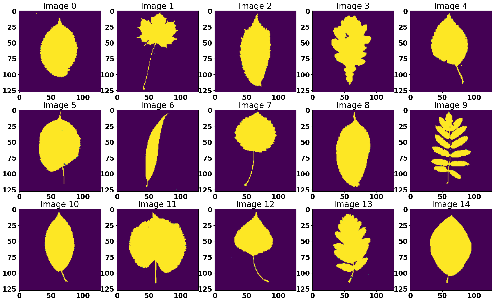
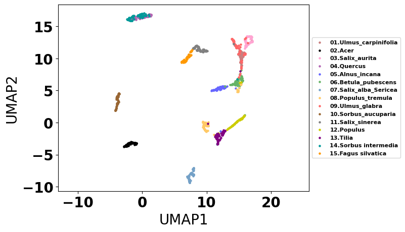
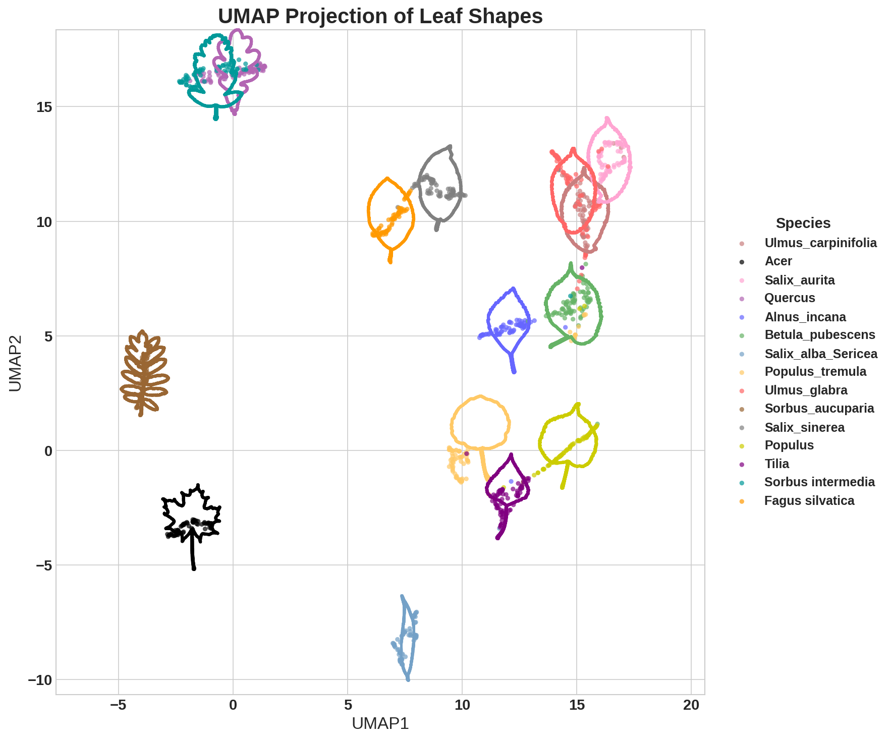

# MO2GP Project
Morphology O(2)-invariant General-purpose Projection (MO2GP) is a shape embedding that is invariant to rotation, reflection, scale, and translation. This pipeline uses initial shape contours, applies a Fourier transform to compute magnitude features, and performs dimensionality reduction to obtain the most informative representations. It is suitable for large-scale morphological datasets. The pipeline is implemented in a Python environment and run using Jupyter Notebook.<br>

## 📥 How to Install

You can install **MO2GP** either directly from GitHub or by cloning the repository for development.

### **Option 1 — Install Directly from GitHub**
Use `pip` to install the latest version from the `main` branch:

```bash
pip install git+https://github.com/Ijoanito/MO2GP.git
```

### **Option 2 — Editable Install (Development Mode)**

```bash
# Clone the repository
git clone https://github.com/Ijoanito/MO2GP.git

# Enter the project directory
cd MO2GP

# Install in editable mode
pip install -e .
```

### **The test after installation**
```bash
from shapealign import ShapeAlign  

import numpy as np

# Example: Create a simple circle contour
circle = np.array([[np.cos(t), np.sin(t)] for t in np.linspace(0, 2*np.pi, 100, endpoint=False)])

shapes = ShapeAlign([circle])
shapes.preprocess_contours()

```
To demonstrate the functionalities of MO2GP, in this tutorial we use 1 simulation dataset, 2 well known datasets, and 1 in house spatial transcriptomics data:
1. **Simulation dataset**<br>
2. **Swedish Leaf dataset**<br>
3. **MPEG-7 dataset**<br>
4. **VeraFISH Healthy BMMC dataset**<br>


## Running ShapeAlign in Jupyter Notebook

Below is an example of how to load the pre-processed "leaf" data (`contour_leaf.pkl`, `label_leaf.pkl`, `image_leaf.npy`),  
plot sample images and contours, run `ShapeAlign` to generate shape embeddings, and then visualize the result using UMAP.

```python
import pickle
import numpy as np
import time
import matplotlib.pyplot as plt
import umap
from align import ShapeAlign

# Path to your files
path = "your_path_here"

# Load contour, label, and image files
with open(path + 'contour_leaf.pkl', 'rb') as f:
    contour_input = pickle.load(f)
with open(path + 'label_leaf.pkl', 'rb') as f:
    labels = pickle.load(f)
labels = np.array(labels)
img_input = np.load(path + 'image_leaf.npy')

# --- Plot images ---
idx = np.arange(5, labels.shape[0], 75)
fig, ax = plt.subplots(ncols=5, nrows=3, figsize=(25, 15))
ax = ax.flatten()
for i in range(len(idx)):
    temp = img_input[idx[i]]
    ax[i].imshow(temp)
    ax[i].set_title(f"Image {i}")
plt.show()

# --- Plot contours ---
idx = np.arange(4, labels.shape[0], 75)
fig, ax = plt.subplots(ncols=5, nrows=3, figsize=(25, 15))
ax = ax.flatten()
for i in range(len(idx)):
    temp = contour_input[idx[i]]
    ax[i].plot(temp[:, 0], temp[:, 1])
    ax[i].invert_yaxis()  # optional, matches image orientation
    ax[i].set_title(f"Contour {i}")
plt.show()

# Start timing
start = time.time()

# Initialize ShapeAlign model
model_align = ShapeAlign(contours=contour_input)

# Preprocess contours - centering, interpolation, smoothing
model_align.preprocess_contours(
    num_workers=8,
    n_interp=250,
    n_smooth=0,
    scale='perimeter'
)

# Compute functions of the contour
model_align.get_embedding(num_workers=1)
print('Running time: ', time.time() - start)

# Retrieve results
shape_embedding = model_align.shape_embedding
contours = model_align.contours

# Compute silhouette score
ss = my_silhouette_score(shape_embedding, labels, metric='euclidean')
print(ss, shape_embedding.shape)

# --- Creating the color dictionary for UMAP plot ---
color_list = [
    (0.788, 0.498, 0.498),     # brown
    (0, 0, 0),                 # black
    (1.0, 0.647, 0.823),       # hotpink
    (0.701, 0.4, 0.701),       # purple
    (0.4, 0.4, 1.0),           # blue
    (0.4, 0.701, 0.4),         # green
    (0.456, 0.632, 0.779),     # steel blue
    (1.0, 0.788, 0.4),         # orange
    (1.0, 0.4, 0.4),           # red
    (0.6, 0.4, 0.2),           # dark brown
    (0.5, 0.5, 0.5),           # gray
    (0.8, 0.8, 0.0),           # yellow
    (0.5, 0.0, 0.5),           # dark purple
    (0.0, 0.6, 0.6),           # teal
    (1.0, 0.6, 0.0)            # dark orange
]
shapes = [
    '01.Ulmus_carpinifolia', '02.Acer', '03.Salix_aurita',
    '04.Quercus', '05.Alnus_incana', '06.Betula_pubescens',
    '07.Salix_alba_Sericea', '08.Populus_tremula', '09.Ulmus_glabra',
    '10.Sorbus_aucuparia', '11.Salix_sinerea', '12.Populus',
    '13.Tilia', '14.Sorbus intermedia', '15.Fagus silvatica'
]
shape_color_dict = dict(zip(shapes, color_list))

# --- Run UMAP ---
fit = umap.UMAP(random_state=19)
embedding = fit.fit_transform(shape_embedding)

# Plot UMAP result
for shape in np.unique(labels):
    plt.scatter(
        embedding[labels == shape, 0],
        embedding[labels == shape, 1],
        s=5, c=[shape_color_dict[shape]],
        label=shape
    )
plt.axis('equal')
plt.xlabel('UMAP1')
plt.ylabel('UMAP2')
plt.legend(title='', loc='center left', bbox_to_anchor=(1, 0.5), fontsize=8)
plt.show()
```

## Example Leaf Plots

### Leaf Images


### Leaf Contours


### Leaf UMAP Visualization after MO2GP


### Leaf UMAP Visualization after MO2GP (Contours on UMAP)

