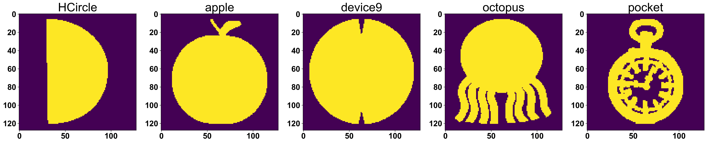
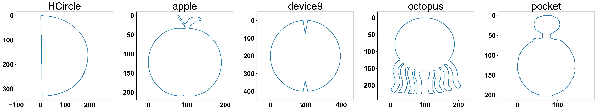

# 3. MPEG-7 Dataset 
Next, we utilized the widely recognized MPEG-7 Dataset.The dataset consists of 1,400 images across 70 fundamental shape categories (20 images per category) and is a standard benchmark for evaluating the performance of shape similarity methods.<br>

Reference:<br>
https://dabi.temple.edu/external/shape/MPEG7/dataset.html<br>

The raw images of MPEG dataset underwent an image preprocessing pipeline to extract the largest contour, following the same method used for Swedish Leaf dataset. The preprocessed contour, image, and label files are available in the MO2GP `datasets` module.

In this tutorial, we focused on a few subset of the MPEG-7 dataset to showcase the MO2GP shape embedding analysis. While the pipeline supports the full 70 shape category, visualizing a subset of the dataset ensures that the resulting UMAP clusters remain distinct and easy to analyze for the user.<br>

## 3a. MPEG7 dataset 15 shapes

### Load the contour file 
```python
import numpy as np
import matplotlib.pyplot as plt
from mo2gp import datasets

# 1. Load the full MPEG7 dataset
mpeg7_data = datasets.load_mpeg7()
all_contours = mpeg7_data["contour"]
all_images = mpeg7_data["images"]
all_labels = mpeg7_data["labels"]

# 2. Define the 15 target shapes
target_shapes = [
    'Glas', 'Heart', 'bell', 'brick', 'cellular_phone',
    'children', 'rat', 'deer', 'flatfish', 'fork', 
    'fountain', 'horseshoe', 'spoon', 'spring', 'teddy'
]

# 3. Create a boolean mask to filter the dataset
mask = np.isin(all_labels, target_shapes)

# Subset the arrays and lists
img_input = all_images[mask]
labels = all_labels[mask]
contour_input = [all_contours[i] for i in range(len(all_labels)) if mask[i]]

# Visualize the processed images 
idx = np.arange(0, labels.shape[0], 20)
fig, ax = plt.subplots(ncols=5, nrows=3, figsize=(25,15))
ax = ax.flatten()
for i in range(len(idx)):
    temp = img_input[idx[i]]
    ax[i].imshow(temp)
    ax[i].set_title(f"{labels[idx[i]]}", fontsize=16)
plt.tight_layout()
plt.show()

# Visualize the contour
fig, ax = plt.subplots(ncols=5, nrows=3, figsize=(25, 15))
ax = ax.flatten()
for i in range(len(idx)):
    temp = contour_input[idx[i]]
    ax[i].plot(temp[:, 0], temp[:, 1])
    ax[i].invert_yaxis()  # optional, matches image orientation
    ax[i].set_title(f"{labels[idx[i]]}", fontsize=16)
    ax[i].axis('equal')  # maintain aspect ratio
plt.tight_layout()
plt.show()
```


### Run MO2GP analysis 
```python
import numpy as np
from sklearn.metrics import silhouette_samples
from mo2gp import ShapeAlign

# 1. Define the custom group-averaged silhouette score
def silhouette_score(dataIn, labels, metric='euclidean'):    
    output_sample = silhouette_samples(dataIn, labels, metric=metric)
    unique_labels = np.unique(labels)
    group_means = np.array([output_sample[labels == label].mean(axis=0) for label in unique_labels])
    return np.mean(group_means)

# 2. Initialize and run MO2GP
model_align = ShapeAlign(contours=contour_input)
model_align.preprocess_contours() 
model_align.get_embedding()

shape_embedding = model_align.shape_embedding
contours = model_align.contours
descriptor = model_align.descriptor

ss = silhouette_score(shape_embedding, labels, metric='euclidean')
print(f"Silhouette Score: {ss:.4f}, Embedding Shape: {shape_embedding.shape}")
```

### UMAP Visualization
```python
import umap
import matplotlib.pyplot as plt

# Define a list of 15 distinct RGB colors 
color_list = [
    (0.788, 0.498, 0.498), # brown
    (0.0, 0.0, 0.0),       # black
    (1.0, 0.647, 0.823),   # hotpink
    (0.701, 0.4, 0.701),   # purple
    (0.4, 0.4, 1.0),       # blue
    (0.4, 0.701, 0.4),     # green
    (0.456, 0.632, 0.779), # steel blue
    (1.0, 0.788, 0.4),     # orange
    (1.0, 0.4, 0.4),       # red
    (0.6, 0.4, 0.2),       # dark brown 
    (0.5, 0.5, 0.5),       # gray
    (0.8, 0.8, 0.0),       # yellow
    (0.5, 0.0, 0.5),       # dark purple
    (0.0, 0.6, 0.6),       # teal
    (1.0, 0.6, 0.0)        # dark orange
]

# Define the 15 shape categories
shapes = [
    'Glas', 'Heart', 'bell', 'brick', 'cellular_phone',
    'children', 'rat', 'deer', 'flatfish', 'fork', 
    'fountain', 'horseshoe', 'spoon', 'spring', 'teddy'
]
        
# Create dictionary mapping shape to color
shape_color_dict = dict(zip(shapes, color_list))

# Run UMAP dimensionality reduction
fit = umap.UMAP(random_state=18)
embedding = fit.fit_transform(shape_embedding)

# Plot the UMAP results
fig, ax = plt.subplots(figsize=(12, 9))
for shape in np.unique(labels):
    ax.scatter(
        embedding[labels == shape, 0],
        embedding[labels == shape, 1],
        s=5,
        c=[shape_color_dict[shape]],  # Wrapped in brackets to prevent RGB dimension errors
        label=shape
    )

ax.axis('equal')
ax.set_xlabel('UMAP1', fontsize=12)
ax.set_ylabel('UMAP2', fontsize=12)
ax.set_title(f'Subset of MPEG-7 Dataset (15 Shapes), SI={ss:.4f}', fontweight='bold', fontsize=24)

# Position the legend outside the plot
plt.legend(title='Shapes', loc='center left', bbox_to_anchor=(1, 0.5), fontsize=14)

plt.tight_layout()
plt.show()
```


### Visualize the representative contour
```python
import umap
import numpy as np
import matplotlib.pyplot as plt
from matplotlib.patches import Polygon
from matplotlib.lines import Line2D

# Run UMAP dimensionality reduction
fit = umap.UMAP(random_state=18)
embedding = fit.fit_transform(shape_embedding)

# Find the representative index (closest to the centroid) for each shape
representative_indices = []
for shape in shapes:
    idxs = np.where(labels == shape)[0]
    if len(idxs) > 0:
        center = embedding[idxs].mean(axis=0)
        dists = np.linalg.norm(embedding[idxs] - center, axis=1)
        representative_indices.append(idxs[np.argmin(dists)])

# Plot the representative contours
scale = 3
fig, ax = plt.subplots(figsize=(12, 9))

for idx in representative_indices:
    shape_name = labels[idx]
    contour = contours[idx].copy()
    contour = contour - contour.mean(axis=0)
    
    # Rotate 180° (flip vertically and horizontally)
    theta = np.pi 
    R = np.array([[np.cos(theta), -np.sin(theta)],
                  [np.sin(theta),  np.cos(theta)]])
    contour = contour @ R.T
    
    # Normalize contour size and scale it
    contour = contour / np.max(np.linalg.norm(contour, axis=1)) 
    contour = contour * scale
    
    # Shift the contour to its actual UMAP coordinate position
    contour = contour + embedding[idx]

    # Add the polygon to the plot using ax.add_patch
    ax.add_patch(
        Polygon(
            contour,
            closed=True,
            fill=False,
            edgecolor=shape_color_dict[shape_name],
            linewidth=2.5
        )
    )

# Create custom legend elements
legend_elements = [
    Line2D([0], [0], color=shape_color_dict[shape], lw=3, label=shape)
    for shape in shapes
]

# Format the plot using ax. methods
ax.axis('equal')
ax.set_xlabel('UMAP1', fontsize=12)
ax.set_ylabel('UMAP2', fontsize=12)
ax.set_title(f'Subset of MPEG-7 Contours (15 Shapes), SI={ss:.4f}', fontweight='bold', fontsize=24)

# Position the legend outside the plot
ax.legend(handles=legend_elements, title='Shapes', loc='center left', bbox_to_anchor=(1.02, 0.5), fontsize=14)

plt.tight_layout()
plt.show()
```


## 3b. MPEG7 dataset device groups
This subset of MPEG7 dataset consist of 10 shape groups labelled as device_0 till device_9. The "devices" range from smooth, recognizable geometric shapes to more complex, jagged forms.

### Load the file and visualize 
```python
import numpy as np
import matplotlib.pyplot as plt
from mo2gp import datasets

# 1. Load the full MPEG7 dataset
mpeg7_data = datasets.load_mpeg7()
all_contours = mpeg7_data["contour"]
all_images = mpeg7_data["images"]
all_labels = mpeg7_data["labels"]

# 2. Define the 15 target shapes
target_shapes = ['device0', 'device1', 'device2', 'device3', 'device4',
                 'device5', 'device6', 'device7', 'device8', 'device9']

# 3. Create a boolean mask to filter the dataset
mask = np.isin(all_labels, target_shapes)

# Subset the arrays and lists
img_input = all_images[mask]
labels = all_labels[mask]
contour_input = [all_contours[i] for i in range(len(all_labels)) if mask[i]]

# Visualize the processed images 
idx = np.arange(0, labels.shape[0], 20)
fig, ax = plt.subplots(ncols=5, nrows=2, figsize=(25,10))
ax = ax.flatten()
for i in range(len(idx)):
    temp = img_input[idx[i]]
    ax[i].imshow(temp)
    ax[i].set_title(f"{labels[idx[i]]}", fontsize=30)
plt.tight_layout()
plt.show()

# Visualize the contour
fig, ax = plt.subplots(ncols=5, nrows=2, figsize=(25, 10))
ax = ax.flatten()
for i in range(len(idx)):
    temp = contour_input[idx[i]]
    ax[i].plot(temp[:, 0], temp[:, 1])
    ax[i].invert_yaxis()  # optional, matches image orientation
    ax[i].set_title(f"{labels[idx[i]]}", fontsize=30)
    ax[i].axis('equal')  # maintain aspect ratio
plt.tight_layout()
plt.show()
```


### Run MO2GP analysis 
```python
import numpy as np
from sklearn.metrics import silhouette_samples
from mo2gp import ShapeAlign

# 1. Define the custom group-averaged silhouette score
def silhouette_score(dataIn, labels, metric='euclidean'):    
    output_sample = silhouette_samples(dataIn, labels, metric=metric)
    unique_labels = np.unique(labels)
    group_means = np.array([output_sample[labels == label].mean(axis=0) for label in unique_labels])
    return np.mean(group_means)

# 2. Initialize and run MO2GP
model_align = ShapeAlign(contours=contour_input)
model_align.preprocess_contours() 
model_align.get_embedding()

shape_embedding = model_align.shape_embedding
contours = model_align.contours
descriptor = model_align.descriptor

ss = silhouette_score(shape_embedding, labels, metric='euclidean')
print(f"Silhouette Score: {ss:.4f}, Embedding Shape: {shape_embedding.shape}")
```

### UMAP Visualization
```python
import umap
import matplotlib.pyplot as plt

# Define a list of 15 distinct RGB colors 
color_list = [
    (0.788, 0.498, 0.498), # brown
    (0, 0, 0),             # black
    (1.0, 0.647, 0.823),   # hotpink
    (0.701, 0.4, 0.701),   # purple
    (0.4, 0.4, 1.0),       # blue
    (0.4, 0.701, 0.4),     # green
    (0.456, 0.632, 0.779), # steel blue
    (1.0, 0.788, 0.4),     # orange
    (1.0, 0.4, 0.4),       # red
    (0.6, 0.4, 0.2)       # dark brown 
]

shapes=['device0', 'device1', 'device2', 'device3', 'device4',
        'device5', 'device6', 'device7', 'device8', 'device9']
        
# Create dictionary mapping shape to color
shape_color_dict = dict(zip(shapes, color_list))

# Run UMAP dimensionality reduction
fit = umap.UMAP(n_neighbors=15, min_dist=0.5, random_state=18)
embedding = fit.fit_transform(shape_embedding)

# Plot the UMAP results
fig, ax = plt.subplots(figsize=(12, 9))
for shape in np.unique(labels):
    ax.scatter(
        embedding[labels == shape, 0],
        embedding[labels == shape, 1],
        s=15,
        c=[shape_color_dict[shape]],  # Wrapped in brackets to prevent RGB dimension errors
        label=shape
    )

ax.axis('equal')
ax.set_xlabel('UMAP1', fontsize=12)
ax.set_ylabel('UMAP2', fontsize=12)
ax.set_title(f'Subset of MPEG-7 Dataset UMAP devices, SI={ss:.4f}', fontweight='bold', fontsize=24)

# Position the legend outside the plot
plt.legend(title='Shapes', loc='center left', bbox_to_anchor=(1, 0.5), fontsize=14)

plt.tight_layout()
plt.show()
```


### Visualize the representative contour
```python
import umap
import numpy as np
import matplotlib.pyplot as plt
from matplotlib.patches import Polygon
from matplotlib.lines import Line2D

# Run UMAP dimensionality reduction
fit = umap.UMAP(n_neighbors=15, min_dist=0.5, random_state=18)
embedding = fit.fit_transform(shape_embedding)

# Find the representative index (closest to the centroid) for each shape
representative_indices = []
for shape in shapes:
    idxs = np.where(labels == shape)[0]
    if len(idxs) > 0:
        center = embedding[idxs].mean(axis=0)
        dists = np.linalg.norm(embedding[idxs] - center, axis=1)
        representative_indices.append(idxs[np.argmin(dists)])

# Plot the representative contours
scale = 3
fig, ax = plt.subplots(figsize=(12, 9))

for idx in representative_indices:
    shape_name = labels[idx]
    contour = contours[idx].copy()
    contour = contour - contour.mean(axis=0)
    
    # Rotate 180° (flip vertically and horizontally)
    theta = np.pi 
    R = np.array([[np.cos(theta), -np.sin(theta)],
                  [np.sin(theta),  np.cos(theta)]])
    contour = contour @ R.T
    
    # Normalize contour size and scale it
    contour = contour / np.max(np.linalg.norm(contour, axis=1)) 
    contour = contour * scale
    
    # Shift the contour to its actual UMAP coordinate position
    contour = contour + embedding[idx]

    # Add the polygon to the plot using ax.add_patch
    ax.add_patch(
        Polygon(
            contour,
            closed=True,
            fill=False,
            edgecolor=shape_color_dict[shape_name],
            linewidth=2.5
        )
    )

# Create custom legend elements
legend_elements = [
    Line2D([0], [0], color=shape_color_dict[shape], lw=3, label=shape)
    for shape in shapes
]

# Format the plot using ax. methods
ax.axis('equal')
ax.set_xlabel('UMAP1', fontsize=12)
ax.set_ylabel('UMAP2', fontsize=12)
ax.set_title(f'Subset of MPEG-7 Dataset UMAP devices, SI={ss:.4f}', fontweight='bold', fontsize=24)

# Position the legend outside the plot
ax.legend(handles=legend_elements, title='Shapes', loc='center left', bbox_to_anchor=(1.02, 0.5), fontsize=14)

plt.tight_layout()
plt.show()
```


The UMAP reveals that MO2GP is able to group the devices based on "edge" or "protrusions". MO2GP clustered device4 and device8 together in the bottom-left quadrant due to their shared three-pointed or triangular-based geometry. In the top-left region, device3, device2, and device5 are grouped together because they all exhibit four-lobed or cross-like structures. Finally, device0 and device7 (rather than device 9) are positioned together in the right area because they both possess star-like protrusions.

## 3C. MPEG7 dataset circle groups
This subset of the MPEG-7 dataset consists of five shape categories that share a common circular base geometry: Apple, Device9, HCircle, Octopus, and Pocket.

### Load the file and visualize 
```python
import numpy as np
import matplotlib.pyplot as plt
from mo2gp import datasets

# 1. Load the full MPEG7 dataset
mpeg7_data = datasets.load_mpeg7()
all_contours = mpeg7_data["contour"]
all_images = mpeg7_data["images"]
all_labels = mpeg7_data["labels"]

# 2. Define the 15 target shapes
target_shapes = ['apple','device9','HCircle','octopus','pocket']

# 3. Create a boolean mask to filter the dataset
mask = np.isin(all_labels, target_shapes)

# Subset the arrays and lists
img_input = all_images[mask]
labels = all_labels[mask]
contour_input = [all_contours[i] for i in range(len(all_labels)) if mask[i]]

# Visualize the processed images 
idx = np.arange(0, labels.shape[0], 20)
fig, ax = plt.subplots(ncols=5, nrows=1, figsize=(25,5))
ax = ax.flatten()
for i in range(len(idx)):
    temp = img_input[idx[i]]
    ax[i].imshow(temp)
    ax[i].set_title(f"{labels[idx[i]]}", fontsize=30)
plt.tight_layout()
plt.show()

# Visualize the contour
fig, ax = plt.subplots(ncols=5, nrows=1, figsize=(25, 5))
ax = ax.flatten()
for i in range(len(idx)):
    temp = contour_input[idx[i]]
    ax[i].plot(temp[:, 0], temp[:, 1])
    ax[i].invert_yaxis()  # optional, matches image orientation
    ax[i].set_title(f"{labels[idx[i]]}", fontsize=30)
    ax[i].axis('equal')  # maintain aspect ratio
plt.tight_layout()
plt.show()
```



### Run MO2GP analysis 
```python
import numpy as np
from sklearn.metrics import silhouette_samples
from mo2gp import ShapeAlign

# 1. Define the custom group-averaged silhouette score
def silhouette_score(dataIn, labels, metric='euclidean'):    
    output_sample = silhouette_samples(dataIn, labels, metric=metric)
    unique_labels = np.unique(labels)
    group_means = np.array([output_sample[labels == label].mean(axis=0) for label in unique_labels])
    return np.mean(group_means)

# 2. Initialize and run MO2GP
model_align = ShapeAlign(contours=contour_input)
model_align.preprocess_contours() 
model_align.get_embedding()

shape_embedding = model_align.shape_embedding
contours = model_align.contours
descriptor = model_align.descriptor

ss = silhouette_score(shape_embedding, labels, metric='euclidean')
print(f"Silhouette Score: {ss:.4f}, Embedding Shape: {shape_embedding.shape}")
```

### UMAP Visualization
```python
import umap
import matplotlib.pyplot as plt

# Define a list of 5 distinct colors 
color_list = [
    (0.788, 0.498, 0.498), # brown
    (1.0, 0.647, 0.823),   # hotpink
    (0.701, 0.4, 0.701),   # purple
    (0.4, 0.701, 0.4),     # green
    (1.0, 0.788, 0.4)     # orange
]

shapes=['apple','device9','HCircle','octopus','pocket']
        
# Create dictionary mapping shape to color
shape_color_dict = dict(zip(shapes, color_list))

# Run UMAP dimensionality reduction
fit = umap.UMAP(random_state=18)
embedding = fit.fit_transform(shape_embedding)

# Plot the UMAP results
fig, ax = plt.subplots(figsize=(12, 9))
for shape in np.unique(labels):
    ax.scatter(
        embedding[labels == shape, 0],
        embedding[labels == shape, 1],
        s=15,
        c=[shape_color_dict[shape]],  # Wrapped in brackets to prevent RGB dimension errors
        label=shape
    )

ax.axis('equal')
ax.set_xlabel('UMAP1', fontsize=12)
ax.set_ylabel('UMAP2', fontsize=12)
ax.set_title(f'Subset of MPEG-7 Dataset UMAP devices, SI={ss:.4f}', fontweight='bold', fontsize=24)

# Position the legend outside the plot
plt.legend(title='Shapes', loc='center left', bbox_to_anchor=(1, 0.5), fontsize=14)

plt.tight_layout()
plt.show()
```


### Visualize the representative contour
```python
import umap
import numpy as np
import matplotlib.pyplot as plt
from matplotlib.patches import Polygon
from matplotlib.lines import Line2D

# Run UMAP dimensionality reduction
fit = umap.UMAP(random_state=18)
embedding = fit.fit_transform(shape_embedding)

# Find the representative index (closest to the centroid) for each shape
representative_indices = []
for shape in shapes:
    idxs = np.where(labels == shape)[0]
    if len(idxs) > 0:
        center = embedding[idxs].mean(axis=0)
        dists = np.linalg.norm(embedding[idxs] - center, axis=1)
        representative_indices.append(idxs[np.argmin(dists)])

# Plot the representative contours
scale = 1
fig, ax = plt.subplots(figsize=(12, 9))

for idx in representative_indices:
    shape_name = labels[idx]
    contour = contours[idx].copy()
    contour = contour - contour.mean(axis=0)
    
    # Rotate 180° (flip vertically and horizontally)
    theta = np.pi 
    R = np.array([[np.cos(theta), -np.sin(theta)],
                  [np.sin(theta),  np.cos(theta)]])
    contour = contour @ R.T
    
    # Normalize contour size and scale it
    contour = contour / np.max(np.linalg.norm(contour, axis=1)) 
    contour = contour * scale
    
    # Shift the contour to its actual UMAP coordinate position
    contour = contour + embedding[idx]

    # Add the polygon to the plot using ax.add_patch
    ax.add_patch(
        Polygon(
            contour,
            closed=True,
            fill=False,
            edgecolor=shape_color_dict[shape_name],
            linewidth=2.5
        )
    )

# Create custom legend elements
legend_elements = [
    Line2D([0], [0], color=shape_color_dict[shape], lw=3, label=shape)
    for shape in shapes
]

# Format the plot using ax. methods
ax.axis('equal')
ax.set_xlabel('UMAP1', fontsize=12)
ax.set_ylabel('UMAP2', fontsize=12)
ax.set_title(f'Subset of MPEG-7 Dataset UMAP devices, SI={ss:.4f}', fontweight='bold', fontsize=24)

# Position the legend outside the plot
ax.legend(handles=legend_elements, title='Shapes', loc='center left', bbox_to_anchor=(1.02, 0.5), fontsize=14)

plt.tight_layout()
plt.show()
```


Despite the circular nature of all five classes, the UMAP showed MO2GP effectively separates the shapes into two distinct zones: the "irregular" shapes (pocket and HCircle) are partitioned toward the bottom and right of the UMAP, while the primary circular cluster (apple, device9, and octopus) occupies the top-left side of the plot. In this circular group, device9 and octopus are clustered tightly due to their similar high-frequency structural details, whereas the apple is positioned further away because of its low-frequency outline.

## 3D. MPEG7 dataset elongated-curved groups
The last subset of MPEG7 dataset is comprised of three groups characterized by their elongated and curving forms: the horseshoe, lizard, and sea_snake.

### Load the file and visualize 
```python
import numpy as np
import matplotlib.pyplot as plt
from mo2gp import datasets

# 1. Load the full MPEG7 dataset
mpeg7_data = datasets.load_mpeg7()
all_contours = mpeg7_data["contour"]
all_images = mpeg7_data["images"]
all_labels = mpeg7_data["labels"]

# 2. Define the 15 target shapes
target_shapes = ['horseshoe','lizzard','sea_snake']

# 3. Create a boolean mask to filter the dataset
mask = np.isin(all_labels, target_shapes)

# Subset the arrays and lists
img_input = all_images[mask]
labels = all_labels[mask]
contour_input = [all_contours[i] for i in range(len(all_labels)) if mask[i]]

# Visualize the processed images 
idx = np.arange(0, labels.shape[0], 20)
fig, ax = plt.subplots(ncols=3, nrows=1, figsize=(15,5))
ax = ax.flatten()
for i in range(len(idx)):
    temp = img_input[idx[i]]
    ax[i].imshow(temp)
    ax[i].set_title(f"{labels[idx[i]]}", fontsize=30)
plt.tight_layout()
plt.show()

# Visualize the contour
fig, ax = plt.subplots(ncols=3, nrows=1, figsize=(15, 5))
ax = ax.flatten()
for i in range(len(idx)):
    temp = contour_input[idx[i]]
    ax[i].plot(temp[:, 0], temp[:, 1])
    ax[i].invert_yaxis()  # optional, matches image orientation
    ax[i].set_title(f"{labels[idx[i]]}", fontsize=30)
    ax[i].axis('equal')  # maintain aspect ratio
plt.tight_layout()
plt.show()
```


### Run MO2GP analysis 
```python
import numpy as np
from sklearn.metrics import silhouette_samples
from mo2gp import ShapeAlign

# 1. Define the custom group-averaged silhouette score
def silhouette_score(dataIn, labels, metric='euclidean'):    
    output_sample = silhouette_samples(dataIn, labels, metric=metric)
    unique_labels = np.unique(labels)
    group_means = np.array([output_sample[labels == label].mean(axis=0) for label in unique_labels])
    return np.mean(group_means)

# 2. Initialize and run MO2GP
model_align = ShapeAlign(contours=contour_input)
model_align.preprocess_contours() 
model_align.get_embedding()

shape_embedding = model_align.shape_embedding
contours = model_align.contours
descriptor = model_align.descriptor

ss = silhouette_score(shape_embedding, labels, metric='euclidean')
print(f"Silhouette Score: {ss:.4f}, Embedding Shape: {shape_embedding.shape}")
```

### UMAP Visualization
```python
import umap
import numpy as np
import matplotlib.pyplot as plt
from matplotlib.patches import Polygon
from scipy.spatial.distance import cdist
from sklearn.cluster import KMeans

# Define a list of 3 distinct colors 
color_list = [
    (1.0, 0.647, 0.823),   # hotpink
    (0.701, 0.4, 0.701),   # purple
    (0.4, 0.701, 0.4),     # green
]

shapes = ['horseshoe', 'lizzard', 'sea_snake']

# Create dictionary mapping shape to color
shape_color_dict = dict(zip(shapes, color_list))

# Run UMAP dimensionality reduction
fit = umap.UMAP(random_state=18)
embedding = fit.fit_transform(shape_embedding)

# Setup coordinate boundaries and constants
x_min, x_max = -8, 16
y_min, y_max = 1, 11
density_factor = 0.015 

# Calculate scale parameters relative to plot window dimensions
base_window_dim = max(x_max - x_min, y_max - y_min)
base_scale = base_window_dim * density_factor
rep_scale = base_scale * 3

# Setup transformation parameters (Rotate shapes 180°)
theta = np.pi 
R = np.array([[np.cos(theta), -np.sin(theta)],
              [np.sin(theta),  np.cos(theta)]])

# Identify Representatives (with Sub-clustering for Lizzard and Sea Snake)
representative_indices = []
split_species = ['lizzard', 'sea_snake']

for shape_name in shapes:
    mask = (labels == shape_name)
    group_points = embedding[mask]
    global_indices = np.where(mask)[0]
    
    if len(group_points) == 0:
        continue

    # Logic: If it is a split species, extract 2 distinct cluster medoids
    if shape_name in split_species:
        kmeans = KMeans(n_clusters=2, n_init=10, random_state=42).fit(group_points)
        centers = kmeans.cluster_centers_
        labels_sub = kmeans.labels_
        
        for i in range(2):
            sub_mask = (labels_sub == i)
            sub_points = group_points[sub_mask]
            sub_global_indices = global_indices[sub_mask]
            
            # Identify closest point to the sub-cluster center (medoid)
            distances = cdist(sub_points, centers[i].reshape(1, -1))
            local_medoid = np.argmin(distances)
            representative_indices.append(sub_global_indices[local_medoid])
    else:
        # Standard logic: Extract single global centroid medoid
        centroid = group_points.mean(axis=0).reshape(1, -1)
        distances = cdist(group_points, centroid)
        local_medoid = np.argmin(distances)
        representative_indices.append(global_indices[local_medoid])

# Initialize Plot
fig, ax = plt.subplots(figsize=(12, 9))
ax.set_xlim(x_min, x_max)
ax.set_ylim(y_min, y_max)

# 1. Plot Background (all individual contours as transparent, filled markers)
for idx, (point, contour_raw) in enumerate(zip(embedding, contours)):
    if (x_min <= point[0] <= x_max) and (y_min <= point[1] <= y_max):
        shape_name = labels[idx]
        
        # Center, rotate, normalize, and reposition the background contour
        c = (contour_raw - contour_raw.mean(axis=0)) @ R.T
        c = (c / np.max(np.linalg.norm(c, axis=1))) * base_scale + point
        
        ax.add_patch(
            Polygon(
                c, 
                closed=True, 
                fill=True, 
                alpha=0.2,
                facecolor=shape_color_dict[shape_name], 
                edgecolor='none'
            )
        )

# 2. Plot Highlighted Representatives (larger, fully opaque shapes with labels)
for idx in representative_indices:
    point = embedding[idx]
    shape_name = labels[idx]
    
    # Center, rotate, normalize, scale up, and shift to cluster center coordinate
    c = (contours[idx] - contours[idx].mean(axis=0)) @ R.T
    c = (c / np.max(np.linalg.norm(c, axis=1))) * rep_scale + point
    
    ax.add_patch(
        Polygon(
            c, 
            closed=True, 
            fill=True, 
            facecolor=shape_color_dict[shape_name],
            linewidth=1.5, 
            zorder=10
        )
    )
    
    # Render label text slightly above the shape center point
    ax.text(
        point[0], point[1] + rep_scale, 
        shape_name, 
        ha='center', 
        fontweight='bold', 
        fontsize=12,
        bbox=dict(facecolor='white', alpha=0.6, lw=0)
    )

# Formatting using template object-oriented style
ax.axis('equal')
ax.set_xlabel('UMAP1', fontsize=12)
ax.set_ylabel('UMAP2', fontsize=12)
ax.set_title(f'MPEG-7 Representative Contours\nSilhouette Index: {ss:.4f}', fontweight='bold', fontsize=24)

fig.tight_layout()
plt.show()
```


The UMAP demonstrates that the shape embedding successfully distinguishes between these three classes, despite their overall similarity as curvilinear forms. The horseshoe and sea_snake are positioned together on the bottom side of the plot because they both possess relatively smooth boundaries. In contrast, the lizard is isolated on the top-left due to the higher frequency variations introduced by its head-leg features that mimics "S" shapes. Both the sea_snake and lizard classes are split into two distinct sub-clusters, reflecting significant intra-group variance. For the sea snakes, this separation likely due to posture (such as "C-shapes" versus "candy cane" shapes), while the lizards are separated into 2 groups becauase of their "leg" and "tail" features.

More detailed tutorials on additional datasets are available here:<br>

[Simulation_Dataset](/README.md) |[Swedish Leaf Dataset](Swedish_Leaf_Dataset.md) | [VeraFISH_Healthy_BMMC_Dataset](VeraFISH_Healthy_BMMC_dataset.md) | 
