# 3. MPEG-7 Dataset 
Next, we utilized the widely recognized MPEG-7 Dataset.The dataset consists of 1,400 images across 70 fundamental shape categories (20 images per category) and is a standard benchmark for evaluating the performance of shape similarity methods.<br>

Reference:<br>
https://dabi.temple.edu/external/shape/MPEG7/dataset.html<br>

The raw images of MPEG dataset underwent an image preprocessing pipeline to extract the largest contour, following the same method used for Swedish Leaf dataset. The preprocessed contour, image, and label files are available in `data` folder. 

In this tutorial, we focused on a few subset of the MPEG-7 dataset to showcase the MO2GP shape embedding analysis. While the pipeline supports the full 70 shape category, visualizing a subset of the dataset ensures that the resulting UMAP clusters remain distinct and easy to analyze for the user.<br>

## 3a. MPEG7 dataset 15 shapes
### Load the contour file 
```python
import pickle

# Load contour, label, and image files
with open(r"User_Path\contour_MPEG_15groups.pkl", 'rb') as f:
    contour_input = pickle.load(f)
with open(r"User_Path\label_MPEG_15groups.pkl", 'rb') as f:
    labels = pickle.load(f)
labels = np.array(labels)
img_input = np.load(r"User_Path\image_MPEG_15groups.npy")

# Visualize the processed images 
idx = np.arange(0, labels.shape[0], 20)
fig, ax = plt.subplots(ncols=5, nrows=4, figsize=(25,20))
ax = ax.flatten()
for i in range(len(idx)):
    temp = img_input[idx[i]]
    ax[i].imshow(temp)
    ax[i].set_title(f"Image {i}")
plt.tight_layout()
plt.show()

# Visualize the contour
idx = np.arange(0, labels.shape[0], 20)
fig, ax = plt.subplots(ncols=5, nrows=4, figsize=(20, 25))
ax = ax.flatten()
for i in range(len(idx)):
    temp = contour_input[idx[i]]
    ax[i].plot(temp[:, 0], temp[:, 1])
    ax[i].invert_yaxis()  # optional, matches image orientation
    ax[i].set_title(f"Contour {i}")
plt.tight_layout()
plt.show()
```
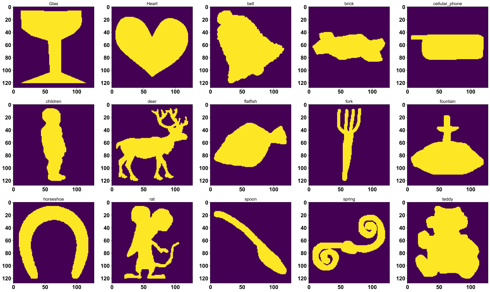
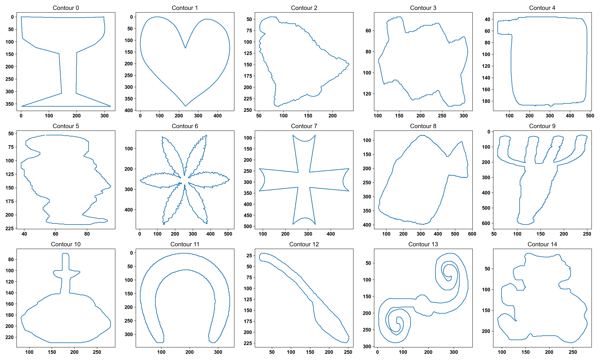
### Run MO2GP analysis 
```python
model_align = ShapeAlign(contours=contour_input)
model_align.preprocess_contours(num_workers=1, n_interp=250, n_smooth=0, scale='perimeter') 
model_align.get_embedding(num_workers=1)

shape_embedding = model_align.shape_embedding
contours = model_align.contours
descriptor = model_align.descriptor

ss = silhouette_score(shape_embedding, labels, metric='euclidean')
print(ss, shape_embedding.shape)
```
### UMAP Visualization
```python
# Define a list of 15 distinct colors 
color_list = [
    (0.788, 0.498, 0.498), # brown
    (0, 0, 0),             # black
    (1.0, 0.647, 0.823),   # hotpink
    (0.701, 0.4, 0.701),   # purple
    (0.4, 0.4, 1.0),       # blue
    (0.4, 0.701, 0.4),     # green
    (0.456, 0.632, 0.779), # steel blue
    (1.0, 0.788, 0.4)     # orange
    (1.0, 0.4, 0.4),       # red
    (0.6, 0.4, 0.2)       # dark brown 
    (0.5, 0.5, 0.5),       # gray
    (0.8, 0.8, 0.0),       # yellow
    (0.5, 0.0, 0.5),       # dark purple
    (0.0, 0.6, 0.6),       # teal
    (1.0, 0.6, 0.0)       # dark orange
]

shapes=['Glas','Heart','bell','brick','cellular_phone',
         'children','device1','device5','flatfish','fork', 
         'fountain','horseshoe','spoon','spring','teddy']

shape_color_dict = dict(zip(shapes, color_list))

fit = umap.UMAP(random_state=19)
embedding = fit.fit_transform(shape_embedding)

for shape in np.unique(labels):
    plt.scatter(
        embedding[labels == shape, 0],
        embedding[labels == shape, 1],
        s=5,
        c=shape_color_dict[shape],
        label=shape
    )

legend_elements = [
    Line2D([0], [0], color=color_list[i], lw=3, label=shapes[i])
    for i in range(5)
]

plt.xlabel('UMAP1')
plt.ylabel('UMAP2')
plt.title(f'Subset of MPEG-7 Dataset UMAP 15 shapes, SI={ss:.4f}', fontweight='bold', fontsize=12)
plt.legend(handles=legend_elements,loc='center left',bbox_to_anchor=(1.02, 0.5), fontsize=15)
plt.show()
```
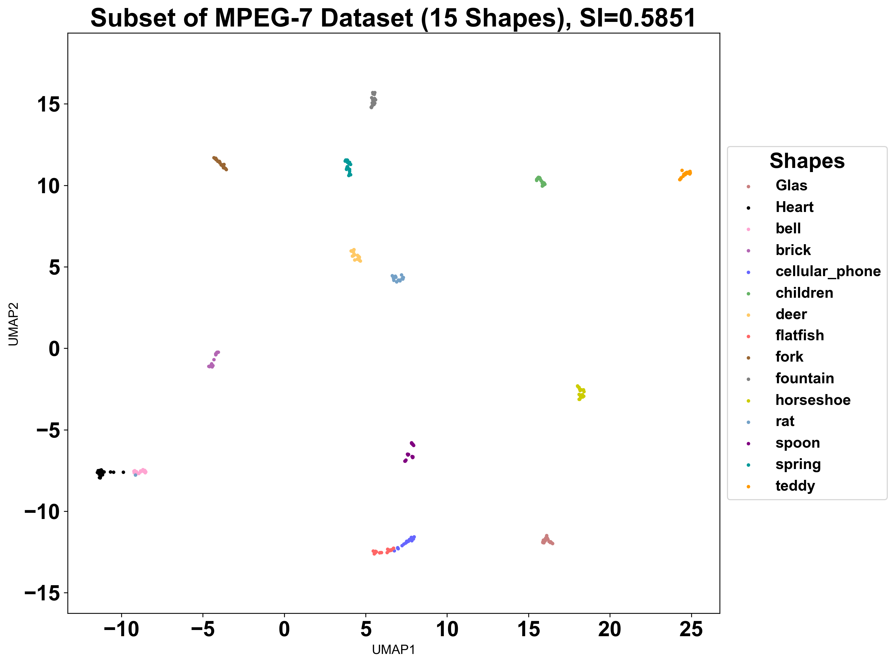

### Visualize the representative contour
```python
from matplotlib.patches import Polygon
import matplotlib.pyplot as plt
from matplotlib.lines import Line2D

# Map shape name → index
shape_to_idx = {shape: i for i, shape in enumerate(shapes)}

# Convert string labels → numeric labels
# labels must be a list/array of shape names
species_labels = np.array([shape_to_idx[l] for l in labels])

# UMAP embedding
fit = umap.UMAP(random_state=19)
embedding = fit.fit_transform(shape_embedding)

# pick one representative per species 
representative_indices = []
for species_idx in range(15):
    idxs = np.where(species_labels == species_idx)[0]
    center = embedding[idxs].mean(axis=0)
    dists = np.linalg.norm(embedding[idxs] - center, axis=1)
    representative_indices.append(idxs[np.argmin(dists)])
scale = 1.2
fig, ax = plt.subplots(figsize=(8, 8))

#overlay contours 
for idx in representative_indices:
    contour = contours[idx]
    contour = contour - contour.mean(axis=0)
    # rotate 180° (flip vertically and horizontally)
    theta = np.pi  # 180 degrees
    R = np.array([[np.cos(theta), -np.sin(theta)],
                  [np.sin(theta),  np.cos(theta)]])
    contour = contour @ R.T
    # normalize contour size 
    contour = contour / np.max(np.linalg.norm(contour, axis=1))
    # scale
    contour = contour * scale
    # shift to UMAP position
    contour = contour + embedding[idx]
    # add polygon
    ax.add_patch(
        Polygon(
            contour,
            closed=True,
            fill=False,
            edgecolor=color_list[species_labels[idx]],
            linewidth=2.5
        )
    )

legend_elements = [
    Line2D([0], [0], color=color_list[i], lw=3, label=shapes[i])
    for i in range(15)
]

ax.set_xlabel("UMAP1")
ax.set_ylabel("UMAP2")
plt.title(f'Subset of MPEG-7 Dataset UMAP (circle) contour, SI={ss:.4f}',fontweight='bold')
ax.axis("equal")
ax.set_aspect("equal", adjustable="box")
ax.legend(handles=legend_elements,loc='center left',bbox_to_anchor=(1.02, 0.5), fontsize=10)
plt.tight_layout()
plt.show()
```
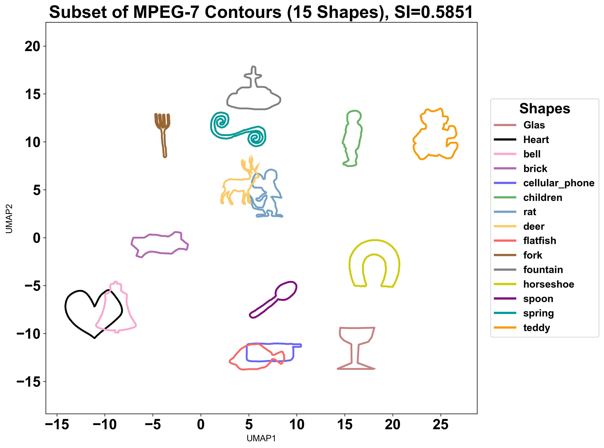

## 3b. MPEG7 dataset device groups
This subset of MPEG7 dataset consist of 10 shape groups labelled as device_0 till device_9. The "devices" range from smooth, recognizable geometric shapes to more complex, jagged forms.
### Load the file and visualize 
```python
import pickle

# Load contour, label, and image files
with open(r"User_Path\contour_MPEG_device.pkl", 'rb') as f:
    contour_input = pickle.load(f)
with open(r"User_Path\label_MPEG_device.pkl", 'rb') as f:
    labels = pickle.load(f)
labels = np.array(labels)
img_input = np.load(r"User_Path\image_MPEG_device.npy")

# Visualize the processed images 
idx = np.arange(0, labels.shape[0], 20) # start= 0 from the first image,stop=labels.shape[0] = 1400 → go up to 1400 (not inclusive),step=20(pick every 20th image)
fig, ax = plt.subplots(ncols=5, nrows=2, figsize=(20, 8))
ax = ax.flatten()
for i in range(len(idx)):
    temp = img_input[idx[i]]
    ax[i].imshow(temp)
    ax[i].set_title(f"Image {i}")
plt.tight_layout()
plt.show()

# Visualize the contour
idx = np.arange(0, labels.shape[0], 20)
fig, ax = plt.subplots(ncols=5, nrows=1, figsize=(20, 8))
ax = ax.flatten()
for i in range(len(idx)):
    temp = contour_input[idx[i]]
    ax[i].plot(temp[:, 0], temp[:, 1])
    ax[i].invert_yaxis() 
    ax[i].set_title(f"Contour {i}")
plt.tight_layout()
plt.show()
```
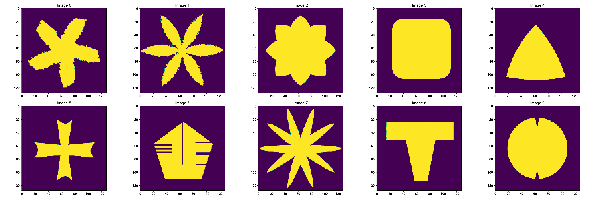
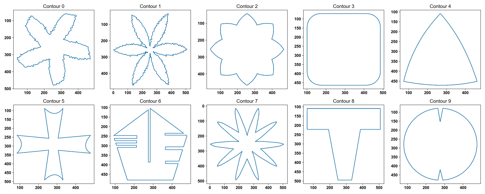

### Run MO2GP analysis 
```python
model_align = ShapeAlign(contours=contour_input)
model_align.preprocess_contours(num_workers=1, n_interp=250, n_smooth=0, scale='perimeter') 
model_align.get_embedding(num_workers=1)

shape_embedding = model_align.shape_embedding
contours = model_align.contours
descriptor = model_align.descriptor

ss = silhouette_score(shape_embedding, labels, metric='euclidean')
print(ss, shape_embedding.shape)
```
### UMAP Visualization
```python
# Define a list of 15 distinct colors 
color_list = [
    (0.788, 0.498, 0.498), # brown
    (0, 0, 0),             # black
    (1.0, 0.647, 0.823),   # hotpink
    (0.701, 0.4, 0.701),   # purple
    (0.4, 0.4, 1.0),       # blue
    (0.4, 0.701, 0.4),     # green
    (0.456, 0.632, 0.779), # steel blue
    (1.0, 0.788, 0.4)     # orange
    (1.0, 0.4, 0.4),       # red
    (0.6, 0.4, 0.2)       # dark brown 
]

shapes=['device0', 'device1', 'device2', 'device3', 'device4','device5', 'device6', 'device7', 'device8', 'device9']

shape_color_dict = dict(zip(shapes, color_list))

fit = umap.UMAP(random_state=19)
embedding = fit.fit_transform(shape_embedding)

for shape in np.unique(labels):
    plt.scatter(
        embedding[labels == shape, 0],
        embedding[labels == shape, 1],
        s=5,
        c=shape_color_dict[shape],
        label=shape
    )

legend_elements = [
    Line2D([0], [0], color=color_list[i], lw=3, label=shapes[i])
    for i in range(10)
]

plt.xlabel('UMAP1')
plt.ylabel('UMAP2')
plt.title(f'Subset of MPEG-7 Dataset UMAP device, SI={ss:.4f}', fontweight='bold', fontsize=12)
plt.legend(handles=legend_elements,loc='center left',bbox_to_anchor=(1.02, 0.5), fontsize=15)
plt.show()
```
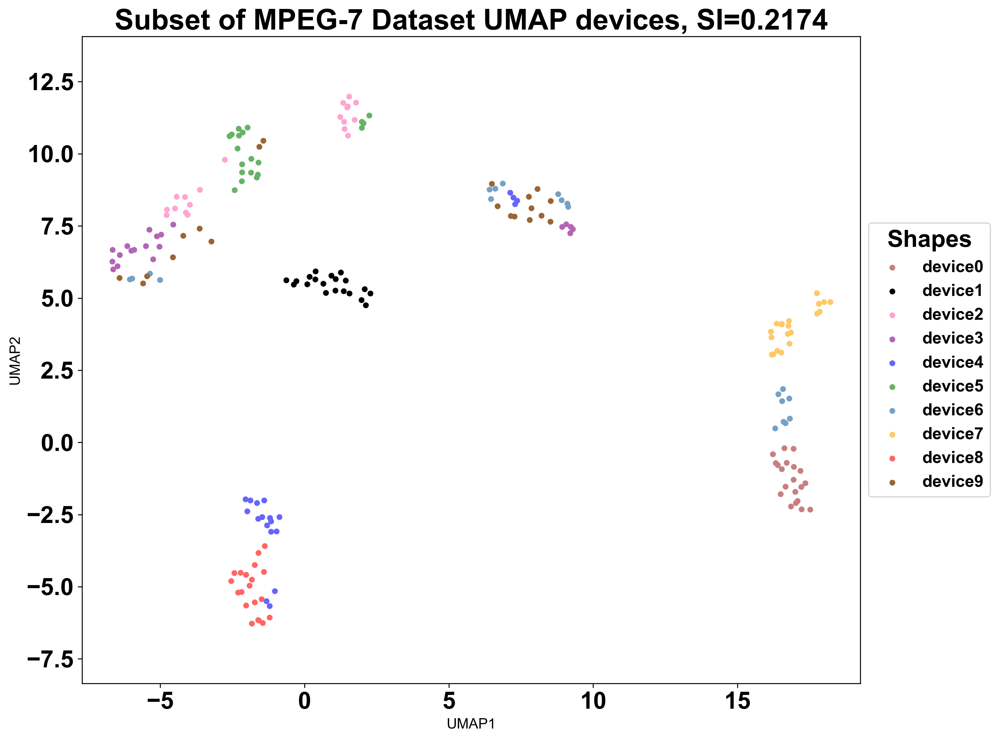
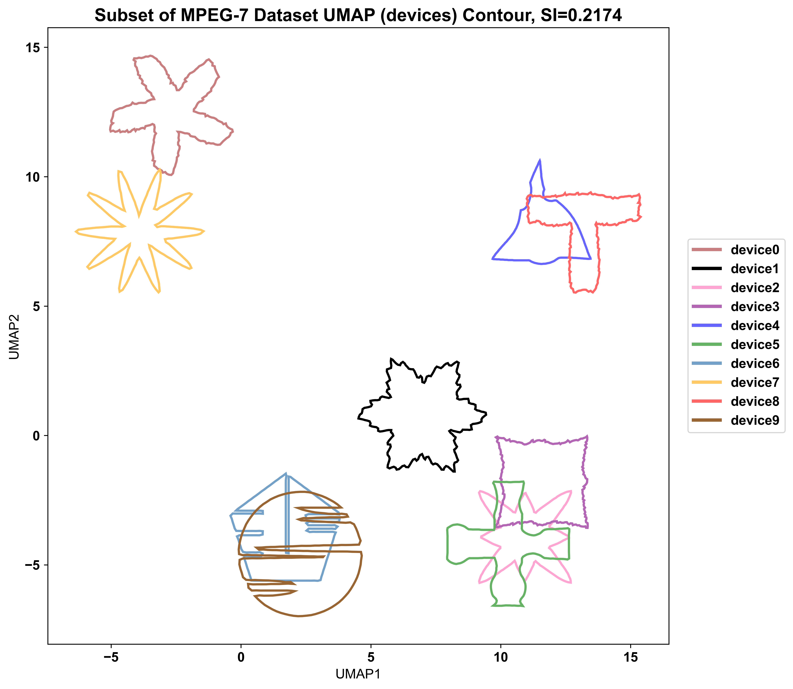

The UMAP reveals that MO2GP is able to group the devices based on "edge" or "protrusions". MO2GP clustered device4 and device8 together in the top-right quadrant due to their shared three-pointed or triangular-based geometry. In the bottom-right region, device3, device2, and device5 are grouped together because they all exhibit four-lobed or cross-like structures. Finally, device0 and device7 (rather than device 9) are positioned together in the top-left area because they both possess star-like protrusions.

## 3C. MPEG7 dataset circle groups
This subset of the MPEG-7 dataset consists of five shape categories that share a common circular base geometry: Apple, Device9, HCircle, Octopus, and Pocket.
### Load the file and visualize 
```python
import pickle

# Load files
with open(r"User_Path\contour_MPEG_circle.pkl", 'rb') as f:
    contour_input = pickle.load(f)
with open(r"User_Path\label_MPEG_circle.pkl", 'rb') as f:
    labels = pickle.load(f)
labels = np.array(labels)
img_input = np.load(r"User_Path\image_MPEG_circle.npy")

# Visualize the processed images 
idx = np.arange(0, labels.shape[0], 20) 
fig, ax = plt.subplots(ncols=5, nrows=1, figsize=(20, 4))
ax = ax.flatten()
for i in range(len(idx)):
    temp = img_input[idx[i]]
    ax[i].imshow(temp)
    ax[i].set_title(f"Image {i}")
plt.tight_layout()
plt.show()

# Visualize the contour
idx = np.arange(0, labels.shape[0], 20)
fig, ax = plt.subplots(ncols=5, nrows=1, figsize=(20, 4))
ax = ax.flatten()
for i in range(len(idx)):
    temp = contour_input[idx[i]]
    ax[i].plot(temp[:, 0], temp[:, 1])
    ax[i].invert_yaxis() 
    ax[i].set_title(f"Contour {i}")
plt.tight_layout()
plt.show()
```


### Run MO2GP analysis 
```python
model_align = ShapeAlign(contours=contour_input)
model_align.preprocess_contours(num_workers=1, n_interp=250, n_smooth=0, scale='perimeter') 
model_align.get_embedding(num_workers=1)

shape_embedding = model_align.shape_embedding
contours = model_align.contours
descriptor = model_align.descriptor

ss = silhouette_score(shape_embedding, labels, metric='euclidean')
print(ss, shape_embedding.shape)
```
### UMAP Visualization
```python
# Define a list of 5 distinct colors 
color_list = [
    (0.788, 0.498, 0.498), # brown
    (1.0, 0.647, 0.823),   # hotpink
    (0.701, 0.4, 0.701),   # purple
    (0.4, 0.701, 0.4),     # green
    (1.0, 0.788, 0.4)     # orange
]

shapes=['apple','device9','HCircle','octopus','pocket']

shape_color_dict = dict(zip(shapes, color_list))

fit = umap.UMAP(random_state=19)
embedding = fit.fit_transform(shape_embedding)

for shape in np.unique(labels):
    plt.scatter(
        embedding[labels == shape, 0],
        embedding[labels == shape, 1],
        s=5,
        c=shape_color_dict[shape],
        label=shape
    )

legend_elements = [
    Line2D([0], [0], color=color_list[i], lw=3, label=shapes[i])
    for i in range(5)
]

plt.xlabel('UMAP1')
plt.ylabel('UMAP2')
plt.title(f'Subset of MPEG-7 Dataset UMAP circle, SI={ss:.4f}', fontweight='bold', fontsize=12)
plt.legend(handles=legend_elements,loc='center left',bbox_to_anchor=(1.02, 0.5), fontsize=15)
plt.show()
```
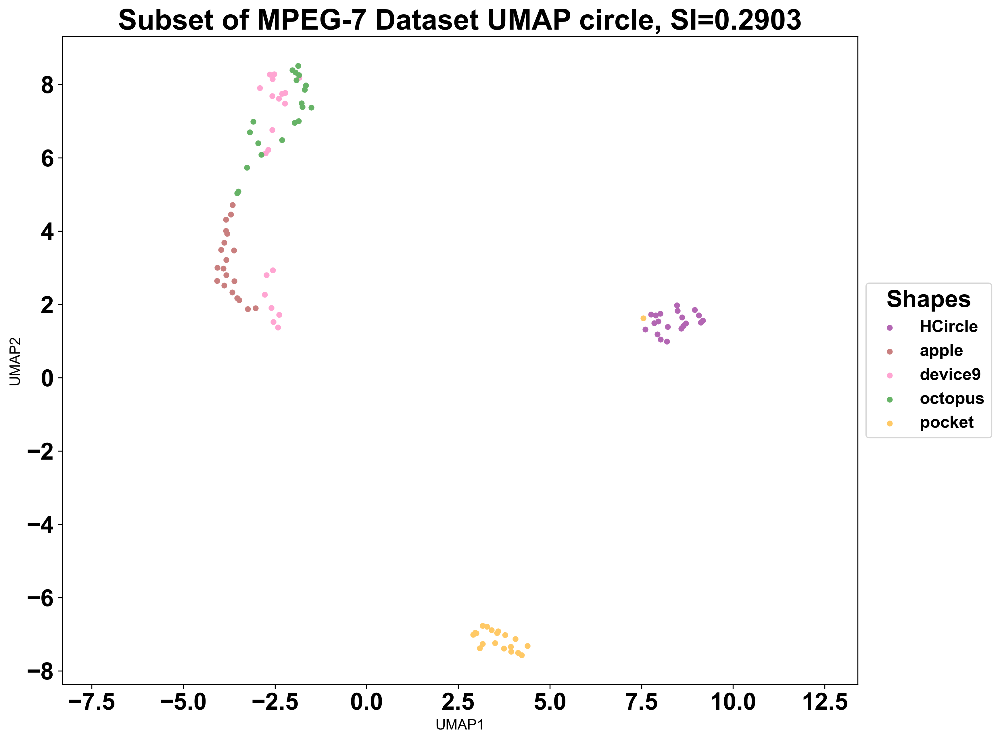
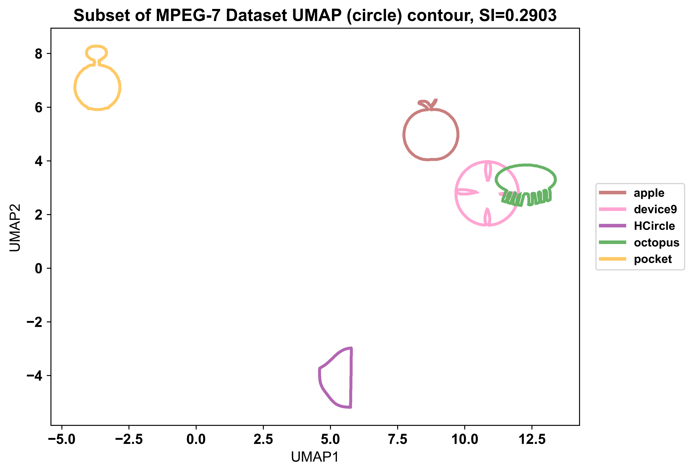

Despite the circular nature of all five classes, the UMAP showed MO2GP effectively separates the shapes into two distinct zones: the "irregular" shapes (pocket and HCircle) are partitioned toward the left and bottom of the UMAP, while the primary circular cluster (apple, device9, and octopus) occupies the right side of the plot. In this circular group, device9 and octopus are clustered tightly due to their similar high-frequency structural details, whereas the apple is positioned further away because of its low-frequency outline.

## 3D. MPEG7 dataset circle groups
The last subset of MPEG7 dataset is comprised of three groups characterized by their elongated and curving forms: the horseshoe, lizard, and sea_snake.
### Load the file and visualize 
```python
import pickle

# Load files
with open(r"User_Path\contour_MPEG_3_similar_groups.pkl", 'rb') as f:
    contour_input = pickle.load(f)
with open(r"User_Path\label_MPEG_3_similar_groups.pkl", 'rb') as f:
    labels = pickle.load(f)
labels = np.array(labels)
img_input = np.load(r"User_Path\image_MPEG_3_similar_groups.npy")

# Visualize the processed images 
idx = np.arange(0, labels.shape[0], 20) 
fig, ax = plt.subplots(ncols=3, nrows=1, figsize=(15, 4))
ax = ax.flatten()
for i in range(len(idx)):
    temp = img_input[idx[i]]
    ax[i].imshow(temp)
    ax[i].set_title(f"Image {i}")
plt.tight_layout()
plt.show()

# Visualize the contour
idx = np.arange(0, labels.shape[0], 20)
fig, ax = plt.subplots(ncols=3, nrows=1, figsize=(15, 4))
ax = ax.flatten()
for i in range(len(idx)):
    temp = contour_input[idx[i]]
    ax[i].plot(temp[:, 0], temp[:, 1])
    ax[i].invert_yaxis() 
    ax[i].set_title(f"Contour {i}")
plt.tight_layout()
plt.show()
```
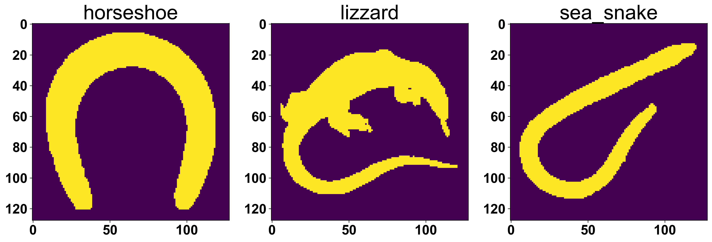
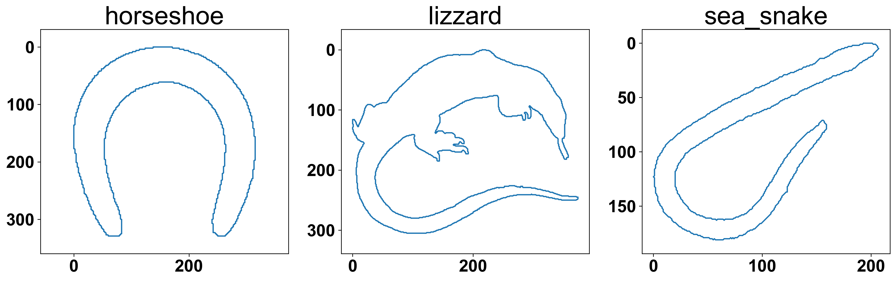

### Run MO2GP analysis 
```python
model_align = ShapeAlign(contours=contour_input)
model_align.preprocess_contours(num_workers=1, n_interp=250, n_smooth=0, scale='perimeter') 
model_align.get_embedding(num_workers=1)

shape_embedding = model_align.shape_embedding
contours = model_align.contours
descriptor = model_align.descriptor

ss = silhouette_score(shape_embedding, labels, metric='euclidean')
print(ss, shape_embedding.shape)
```
### UMAP Visualization
```python
# Define a list of 3 distinct colors 
color_list = [
    (1.0, 0.647, 0.823),   # hotpink
    (0.701, 0.4, 0.701),   # purple
    (0.4, 0.701, 0.4),     # green
]

shapes=['horseshoe','lizzard','sea_snake']

shape_color_dict = dict(zip(shapes, color_list))

fit = umap.UMAP(random_state=19)
embedding = fit.fit_transform(shape_embedding)

for shape in np.unique(labels):
    plt.scatter(
        embedding[labels == shape, 0],
        embedding[labels == shape, 1],
        s=5,
        c=shape_color_dict[shape],
        label=shape
    )

legend_elements = [
    Line2D([0], [0], color=color_list[i], lw=3, label=shapes[i])
    for i in range(3)
]

plt.xlabel('UMAP1')
plt.ylabel('UMAP2')
plt.title(f'Subset of MPEG-7 Dataset UMAP curve, SI={ss:.4f}', fontweight='bold', fontsize=12)
plt.legend(handles=legend_elements,loc='center left',bbox_to_anchor=(1.02, 0.5), fontsize=15)
plt.show()
```
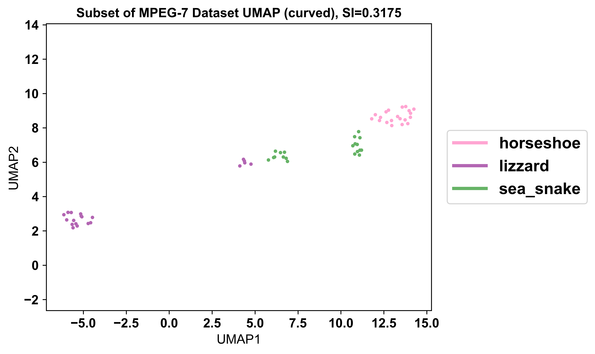

### Visualize the representative contour
```python
from sklearn.cluster import KMeans
from scipy.spatial.distance import cdist

shape_to_idx = {shape: i for i, shape in enumerate(shapes)}
species_labels = np.array([shape_to_idx[l] for l in labels])

x_min, x_max = -8, 16
y_min, y_max = 1, 11

# Setup Constants & Rotation 
theta = np.pi  # 180 degrees
R = np.array([[np.cos(theta), -np.sin(theta)],
              [np.sin(theta),  np.cos(theta)]])

density_factor = 0.015 
# Base scale for the background of shapes
base_scale = max(x_max - x_min, y_max - y_min) * density_factor
# Larger scale for the representatives
rep_scale = base_scale * 3

# Identify Representatives (with Sub-clustering for Lizzard/Sea Snake)
representative_indices = []

# List of species you want to split into 2 clusters
split_species = ['lizzard', 'sea_snake']

for species_idx, name in enumerate(shapes):
    mask = (species_labels == species_idx)
    group_points = embedding[mask]
    global_indices = np.where(mask)[0]
    
    if len(group_points) == 0:
        continue

    # Logic: If it's one of the split species, find 2 representatives
    if name in split_species:
        # Run K-Means to find the two distinct clusters in UMAP space
        kmeans = KMeans(n_clusters=2, n_init=10, random_state=42).fit(group_points)
        centers = kmeans.cluster_centers_
        labels_sub = kmeans.labels_
        
        for i in range(2):
            sub_mask = (labels_sub == i)
            sub_points = group_points[sub_mask]
            sub_global_indices = global_indices[sub_mask]
            
            # Find medoid for this sub-cluster
            distances = cdist(sub_points, centers[i].reshape(1, -1))
            local_medoid = np.argmin(distances)
            representative_indices.append(sub_global_indices[local_medoid])
    
    else:
        # Standard logic for other species (1 representative)
        centroid = group_points.mean(axis=0).reshape(1, -1)
        distances = cdist(group_points, centroid)
        local_medoid = np.argmin(distances)
        representative_indices.append(global_indices[local_medoid])

# Plot
fig, ax = plt.subplots(figsize=(10, 8))
ax.set_xlim(x_min, x_max)
ax.set_ylim(y_min, y_max)

# Plot Background
for idx, (point, contour_raw) in enumerate(zip(embedding, contours)):
    if (x_min <= point[0] <= x_max) and (y_min <= point[1] <= y_max):
        c = (contour_raw - contour_raw.mean(axis=0)) @ R.T
        c = (c / np.max(np.linalg.norm(c, axis=1))) * base_scale + point
        ax.add_patch(Polygon(c, closed=True, fill=True, alpha=0.2,
                             facecolor=color_list[species_labels[idx]], edgecolor='none'))

# Plot Representatives contour
for idx in representative_indices:
    point = embedding[idx]
    c = (contours[idx] - contours[idx].mean(axis=0)) @ R.T
    c = (c / np.max(np.linalg.norm(c, axis=1))) * rep_scale + point
    
    ax.add_patch(Polygon(c, closed=True, fill=True, facecolor=color_list[species_labels[idx]],
                         # edgecolor='white',
                         linewidth=1.5, zorder=10))
    
    # Label
    ax.text(point[0], point[1] + rep_scale, shapes[species_labels[idx]], 
            ha='center', fontweight='bold', bbox=dict(facecolor='white', alpha=0.6, lw=0))

plt.title(f'MPEG-7 Representative (curved) Contours\nSilhouette Index: {ss:.4f}', fontweight="bold", fontsize=15)
plt.show()
```
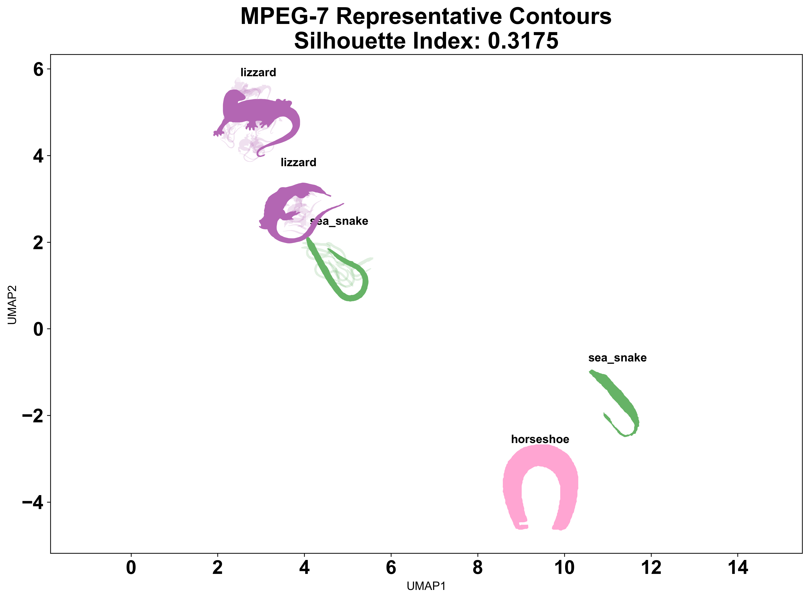

The UMAP demonstrates that the shape embedding successfully distinguishes between these three classes, despite their overall similarity as curvilinear forms. The horseshoe and sea_snake are positioned together on the right side of the plot because they both possess relatively smooth boundaries. In contrast, the lizard is isolated on the left due to the higher frequency variations introduced by its "leg" features. Both the sea_snake and lizard classes are split into two distinct sub-clusters, reflecting significant intra-group variance. For the sea snakes, this separation likely due to posture (such as "C-shapes" versus "candy cane" shapes), while the lizards are separated into 2 groups becauase of their "leg" and "tail" features.

More detailed tutorials on additional datasets are available here:

[Swedish Leaf Dataset](./tutorials/Swedish_Leaf_Dataset.md) | [VeraFISH_Healthy_BMMC_Dataset](./tutorials/VeraFISH_Healthy_BMMC_dataset.md) | [Simulation_Dataset](../)
