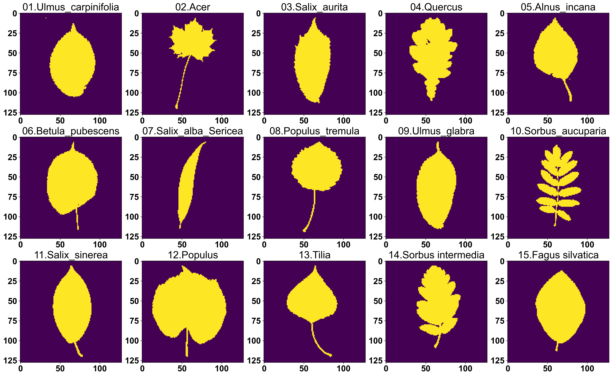
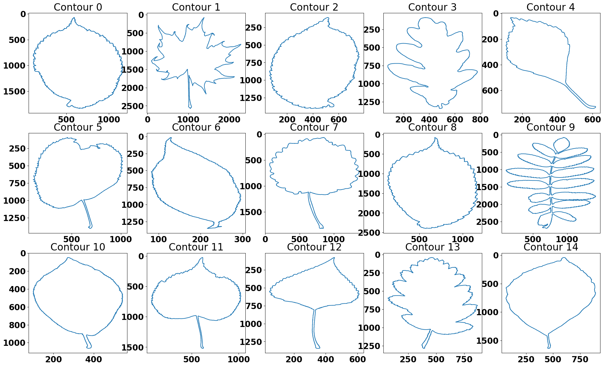
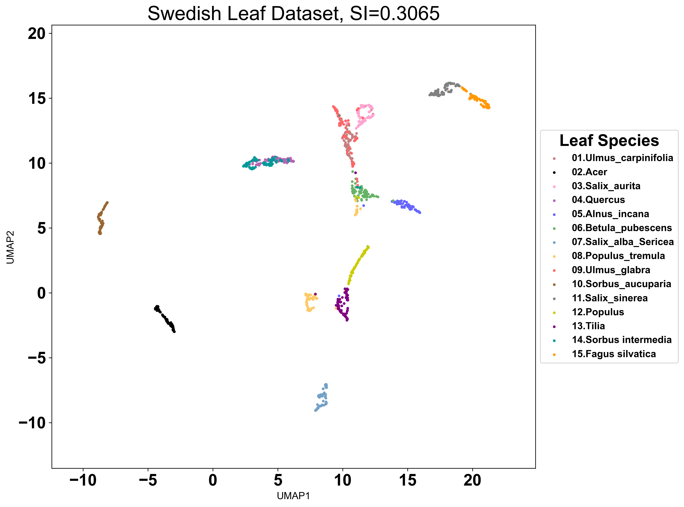
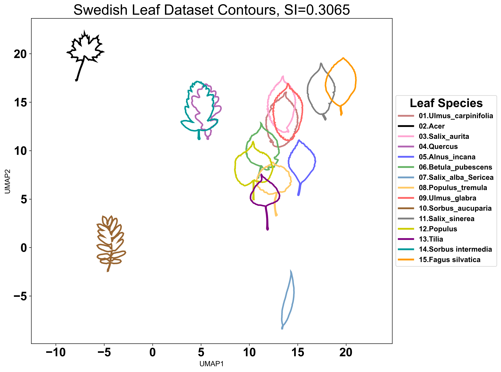
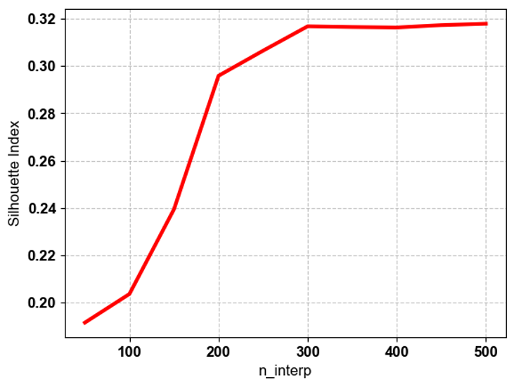
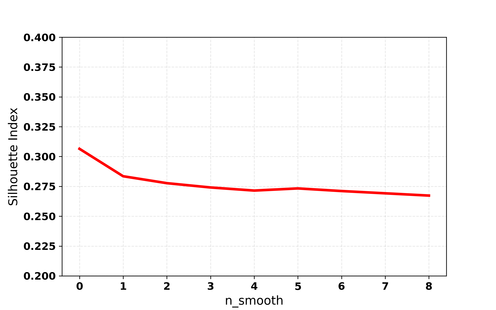

# 2.Swedish Leaf Dataset
We also applied the MO2GP shape embedding pipeline to the Swedish Leaf Dataset, which consists of 15 distinct leaf species with 75 examples each, totaling 1,125 images. <br>

Reference:<br>
Söderkvist, O. J. O. (2001). Computer vision classification of leaves from Swedish trees (Master's Thesis). Linköping University.

## Images Preprocessing <br>
MO2GP utilizes the largest continuous contour from each object as the primary input. Therefore, preprocessing workflow is needed.<br>
First, we need to extracts the largest external contour and generates a corresponding binary mask for each sample. These contours, along with their associated labels and processed images, are then stored for downstream shape embedding and analysis (available in `data` folder).<br>

```python
from PIL import Image
from tqdm import tqdm
import numpy as np
import cv2
import pickle

# Custom function to get the image and contour 
def get_image_and_contours(img_path, size=128, threshold=128, invert_background=False):
    try:
        # Open image and convert to grayscale
        img = Image.open(img_path).convert("L")  # "L" for grayscale
    except IOError:
        raise FileNotFoundError(f"Cannot load {img_path}")
    
    # Convert to OpenCV format (numpy array)
    img = np.array(img)

    # Normalize the image to the range [0, 255] if it's not already in uint8 format
    if img.dtype != np.uint8:
        img = cv2.normalize(img, None, 0, 255, cv2.NORM_MINMAX).astype(np.uint8)

    # Invert the background if it is bright (background needs to be 0)
    if invert_background:
        img = 255 - img

    # Apply binary thresholding to segment the leaf
    _, binary = cv2.threshold(img, threshold, 255, cv2.THRESH_BINARY)

    # Get original dimensions
    h, w = binary.shape
    # Determine the scaling factor based on the largest dimension
    scale = size / max(h, w)
    new_w, new_h = int(w * scale), int(h * scale)
    # Resize while maintaining aspect ratio
    img_resized = cv2.resize(binary, (new_w, new_h), interpolation=cv2.INTER_CUBIC)

    # Create a 128x128 black image for padding
    img_padded = np.zeros((size, size), dtype=np.uint8)
    # Calculate padding
    top = (size - new_h) // 2
    bottom = size - new_h - top
    left = (size - new_w) // 2
    right = size - new_w - left
    # Apply padding to the resized image
    img_padded[top:top + new_h, left:left + new_w] = img_resized

    # Find the largest continuous contour (external shape)
    contours, _ = cv2.findContours(binary, cv2.RETR_EXTERNAL, cv2.CHAIN_APPROX_NONE)
    largest_contour = None
    if contours:
        # Select the largest contour
        largest_contour = max(contours, key=cv2.contourArea)
        largest_contour = largest_contour.reshape(-1, 2)
    
    return img_padded, largest_contour

# Initialize data containers
contour_input = []
labels = []
img_input = []

# Define directory
path = "User_Path\\Leaf_Dataset"

# Get a list of all items in the directory
folders = sorted ([f for f in os.listdir(path) if not f.startswith('.')])

# Initialize counter variable
ino = 0

for cur_folder in tqdm(folders, position=0, leave=True):
    files = [f for f in os.listdir(os.path.join(path, cur_folder)) if not f.startswith('.')]

    labels.extend([cur_folder] * len(files))

    # Loop through each individual file within the current folder
    for file in files:
        img_path = os.path.join(path, cur_folder, file)
        cur_img, cur_cont = get_image_and_contours(
            img_path, 
            size=128, 
            threshold=64, 
            invert_background=False)
        img_input.append(cur_img)
        contour_input.append(cur_cont)

#Finalize and Save Data
img_input = np.array(img_input)

# Open a file in "write binary"  mode to save contour data
with open("User_Path\\contour_leaf.pkl", "wb") as f:
    pickle.dump(contour_input, f)

# Open a new file to save the label data
with open("User_Path\\label_leaf.pkl", "wb") as f:
    pickle.dump(labels, f)

# Save the img_input NumPy array to a file using NumPy's efficient .npy format
np.save(file="User_Path\\\image_leaf.npy", arr=img_input)
```
## Load the pre-processed file and visualize the image and contour file.<br>
```python
#Load Data
with open ("User_Path\\contour_leaf.pkl", "rb") as f:
     contour_input = pickle.load(f)
with open("User_Path\\label_leaf.pkl", "rb") as f:
     labels = pickle.load(f)
labels = np.array(labels)

# Visualize the processed images
idx = np.arange(5, labels.shape[0], 75)
fig, ax = plt.subplots(ncols=5, nrows=3, figsize=(25, 15))
ax = ax.flatten()
for i in range(len(idx)):
    temp = img_input[idx[i]]
    ax[i].imshow(temp)
    ax[i].set_title(f"Image {i}")
plt.show()

# Visualize the contour
idx = np.arange(4, labels.shape[0], 75)
fig, ax = plt.subplots(ncols=5, nrows=3, figsize=(25, 15))
ax = ax.flatten()
for i in range(len(idx)):
    temp = contour_input[idx[i]]
    ax[i].plot(temp[:, 0], temp[:, 1])
    ax[i].invert_yaxis()  # optional, matches image orientation
    ax[i].set_title(f"Contour {i}")
plt.show()
```



## Run MO2GP shape embedding 
```python
#MO2GP
model_align = ShapeAlign(contours=contour_input)
model_align.preprocess_contours(num_workers=1, n_interp=250, n_smooth=0, scale='perimeter')
model_align.get_embedding(num_workers=1)

shape_embedding = model_align.shape_embedding
contours = model_align.contours
descriptor = model_align.descriptor

ss = silhouette_score(shape_embedding, labels, metric='euclidean')
print(f'Silhouette score = {ss:.4f} ', shape_embedding.shape)
```
# Generate UMAP for MO2GP visualization
```python
# Define a list of 15 distinct colors 
color_list = [
    (0.788, 0.498, 0.498), # brown
    (0, 0, 0),             # black
    (1.0, 0.647, 0.823),   # hotpink
    (0.701, 0.4, 0.701),   # purple
    (0.4, 0.4, 1.0),       # blue
    (0.4, 0.701, 0.4),     # green
    (0.456, 0.632, 0.779), # steel blue
    (1.0, 0.788, 0.4),     # orange
    (1.0, 0.4, 0.4),       # red
    (0.6, 0.4, 0.2),       # dark brown
    (0.5, 0.5, 0.5),       # gray
    (0.8, 0.8, 0.0),       # yellow
    (0.5, 0.0, 0.5),       # dark purple
    (0.0, 0.6, 0.6),       # teal
    (1.0, 0.6, 0.0)        # dark orange
]

# Define list of 15 leaf class names
shapes = [
    '01.Ulmus_carpinifolia', '02.Acer', '03.Salix_aurita',
    '04.Quercus', '05.Alnus_incana', '06.Betula_pubescens',
    '07.Salix_alba_Sericea', '08.Populus_tremula', '09.Ulmus_glabra',
    '10.Sorbus_aucuparia', '11.Salix_sinerea', '12.Populus',
    '13.Tilia', '14.Sorbus intermedia', '15.Fagus silvatica'
]

# Use zip and dict for create a dictionary that maps each shape name to a color
shape_color_dict = dict(zip(shapes, color_list))
shape_color_dict

#Run UMAP 
fit = umap.UMAP(random_state=19)
embedding = fit.fit_transform(shape_embedding)

#Plot the UMAP 
for shape in np.unique(labels):
    plt.scatter(
        embedding[labels == shape, 0],
        embedding[labels == shape, 1],
        s=5,
        c=shape_color_dict[shape],
        label=shape
)

plt.axis('equal')
plt.xlabel('UMAP1')
plt.ylabel('UMAP2')
plt.title(f'Swedish Leaf Dataset, SI={ss:.4f}')
plt.legend(title='', loc='center left', bbox_to_anchor=(1, 0.5), fontsize=8)
plt.show()
```


User also can visualize the shape represented by each cluster using the code below :
``` python
from matplotlib.patches import Polygon
import matplotlib.pyplot as plt
from matplotlib.lines import Line2D

# Map shape name → index
shape_to_idx = {shape: i for i, shape in enumerate(shapes)}
species_labels = np.array([shape_to_idx[l] for l in labels])

fit = umap.UMAP(
    n_neighbors=50,
    min_dist=0.2,
    random_state=18
)
embedding = fit.fit_transform(shape_embedding)

representative_indices = []
for species_idx in range(15):
    idxs = np.where(species_labels == species_idx)[0]
    center = embedding[idxs].mean(axis=0)
    dists = np.linalg.norm(embedding[idxs] - center, axis=1)
    representative_indices.append(idxs[np.argmin(dists)])

scale = 3
fig, ax = plt.subplots(figsize=(17, 10))
for idx in representative_indices:
    contour = contours[idx]
    contour = contour - contour.mean(axis=0)
    # rotate 180° (flip vertically and horizontally)
    theta = np.pi  # 180 degrees
    R = np.array([[np.cos(theta), -np.sin(theta)],
                  [np.sin(theta),  np.cos(theta)]])
    contour = contour @ R.T
    # normalize contour size 
    contour = contour / np.max(np.linalg.norm(contour, axis=1)) # to make all the representative contour same size 
    # scale
    contour = contour * scale
    # shift to UMAP position
    contour = contour + embedding[idx]

    # add polygon
    ax.add_patch(
        Polygon(
            contour,
            closed=True,
            fill=False,
            edgecolor=color_list[species_labels[idx]],
            linewidth=2.5
        )
    )

legend_elements = [
    Line2D([0], [0], color=color_list[i], lw=3, label=shapes[i])
    for i in range(15)
]

ax.set_xlabel("UMAP1")
ax.set_ylabel("UMAP2")
plt.title(f'Swedish Leaf Dataset Contours, SI={ss:.4f}')
ax.axis("equal")
ax.set_aspect("equal", adjustable="box")
ax.legend(handles=legend_elements,loc='center left',bbox_to_anchor=(1.02, 0.5), fontsize=10)
plt.tight_layout()
plt.show()
```


The UMAP visualization demonstrates that the MO2GP effectively separates leaf species based on their morphological complexity and boundary frequencies. Distinctive shapes, such as Acer (maple-like) and Sorbus aucuparia, are isolated on the left, while the elongated Salix alba Sericea is partitioned to the bottom right. Conversely, leaf with similar shape profiles are clustered in close region, including the Sorbus intermedia/Quercus group and the Fagus silvatica/Salix cinerea pairing. Furthermore, a tight cluster formed by Salix aurita, Ulmus glabra, and Ulmus carpinifolia—along with four other species—highlight the MO2GP's ability to group leaves based on shared frequency details and overall contour signatures.

# MO2GP Parameter Optimization
In this tutorial, we adjusted MO2GP shape embedding parameter using the Swedish Leaf dataset. We evaluated values of **n_interp** ranging from 50 to 500, while using default parameter for other parameters, and the results are shown in the line graph. The silhouette index increased with larger **n_interp** values but reached a plateau at **n_interp** = 300. This indicates that increasing **n_interp** beyond this point does not lead to further improvement in clustering performance. Therefore, users should tune **n_interp** based on their specific dataset, as higher values do not necessarily correlate with a higher silhouette index. 


Additionally, we examined the impact of the **n_smooth** parameter by testing values ranging from 0 to 8 and evaluating the results using the Silhouette Index (SI). While we observed a slight downward trend in the SI as **n_smooth** increased, this decrease was not really significant. This indicates that for this leaf dataset, additional smoothing does not substantially improve clustering performance. Therefore, we have set the default value for **n_smooth** to 0 in this tutorial.



More detailed tutorials on additional datasets are available here:

[S_Dataset](/README.md) | [MPEG7 Dataset](./tutorials/MPEG7_Dataset.md) |
[VeraFISH_Healthy_BMMC_Dataset](./tutorials/VeraFISH_Healthy_BMMC_dataset.md) 
