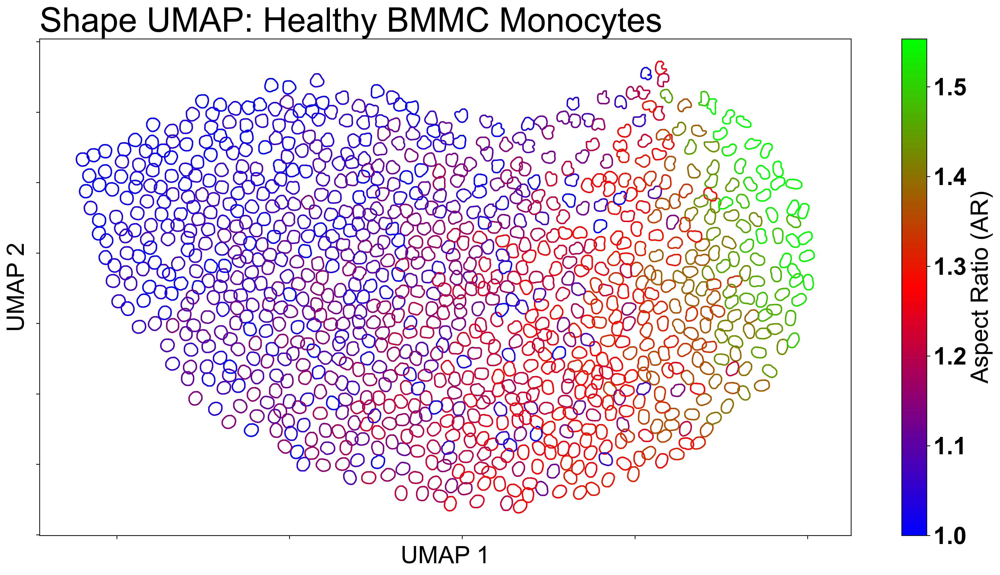
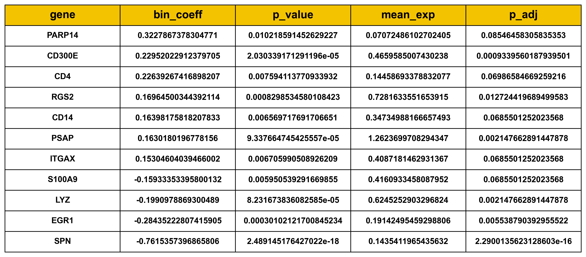
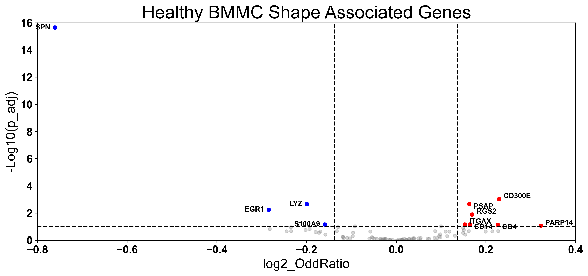

# VeraFISH Healthy BMMC dataset 
Finally, we applied shape embedding to our in-house spatial transcriptomics dataset, generated using the VeraFISH platform (492 genes).<br> For this tutorial, we will focus on the nuclear morphology of the myeloid population derived from healthy Human Bone Marrow Mononuclear Cells (BMMCs).<br>

These clean data, which has already undergone quality control, batch correction, clustering, and cell-type annotation (as described in detail in our paper), is provided in the `datasets` module.

## Load Contour and Metadata
```python
import numpy as np
import pandas as pd
import anndata as ad
import scanpy
from mo2gp import datasets

# Load the VeraFISH BMMC data from the package
bmmc_data = datasets.load_healthy_bmmc()

# Extract the preprocessed contours and metadata
contours_input = bmmc_data["contour"]
df_BMMC_mono = bmmc_data["metadata"]

## Create Anndata
metadata_cols = ["dataset", "batch", "area", "x", "y","cell_id","ncount","nodg","celltype"]
gene_cols = [col for col in df_BMMC_mono.columns if col not in metadata_cols]
gene_expression = df_BMMC_mono[gene_cols]

adata = ad.AnnData(X=gene_expression.values.copy(), dtype=np.float32)
adata.var_names = gene_expression.columns
adata.obs_names = df_BMMC_mono.index.astype(str)

for col in metadata_cols:
    if col in df_BMMC_mono.columns:
        adata.obs[col] = df_BMMC_mono[col].values

adata.layers["counts"] = adata.X.copy()
scale_factor = 50
scanpy.pp.normalize_total(adata, target_sum=scale_factor)
scanpy.pp.log1p(adata)
adata.layers["data"] = adata.X.copy()
scanpy.pp.scale(adata)
scanpy.tl.pca(adata, n_comps=30)
scanpy.pp.neighbors(adata, n_neighbors=30, n_pcs=10)
```

## Run MO2GP analysis
```python
from mo2gp import ShapeAlign

model_align = ShapeAlign(contours = contours_input)
model_align.preprocess_contours(num_workers=1, n_interp=250, n_smooth=0, scale='perimeter') 
model_align.get_embedding() 

shape_embedding = model_align.shape_embedding
contours = model_align.contours
descriptor = model_align.descriptor
```

## Create sdata to store shape embedding, PCA , Clustering, shape DPT 
```python
sdata = ad.AnnData(shape_embedding, dtype=shape_embedding.dtype)
sdata.obs['aspect_ratio'] = descriptor[:,0]
sdata.obs['circularity'] = descriptor[:,1]
sdata.obs['eccentricity'] = descriptor[:,2]
sdata.obs['extent'] = descriptor[:,3]
sdata.obs['roundness'] = descriptor[:,4]
sdata.obs['solidity'] = descriptor[:,5]
sdata.obs['area'] = descriptor[:,6]

sdata.obsm['X_pca'] = shape_embedding
scanpy.pp.neighbors(sdata, use_rep='X_pca', n_neighbors=15)
scanpy.tl.umap(sdata)
scanpy.tl.leiden(sdata, resolution=1, flavor="leidenalg", n_iterations=2)

# Diffmap & DPT using the neighbor graph
sdata.uns['iroot'] = np.argmin(np.std(np.linalg.norm(contours, axis=2), axis=1))
scanpy.tl.diffmap(sdata, n_comps=15)
scanpy.tl.dpt(sdata, n_dcs=15)
```

## Visualize the aspect ratio and shape-DPT Pseudotime
```python
import numpy as np
import matplotlib.pyplot as plt

umap = sdata.obsm['X_umap']
plt.rcParams.update({'font.size': 25})

fig, ax = plt.subplots(ncols=2, nrows=1, figsize=(32, 9))

vmax_dpt = np.nanquantile(sdata.obs['dpt_pseudotime'], q=0.99)
# --- Plot 1: DPT ---
pl1 = ax[0].scatter(
    umap[:,0], umap[:,1], 
    c=sdata.obs['dpt_pseudotime'], 
    s=1, 
    cmap='gist_rainbow_r', 
    vmax=vmax_dpt
)
fig.colorbar(pl1, ax=ax[0])

ax[0].scatter(umap[sdata.uns['iroot'], 0], umap[sdata.uns['iroot'], 1], c='k', s=10, zorder=5)
ax[0].set_title('Diffusion Pseudotime (DPT)')
ax[0].invert_yaxis()
ax[0].invert_xaxis()
ax[0].set_xlabel('UMAP_1')
ax[0].set_ylabel('UMAP_2')

# --- Plot 2: Aspect Ratio ---
vmax_aspect = np.nanquantile(sdata.obs['aspect_ratio'], q=0.99)
pl2 = ax[1].scatter( 
    umap[:,0], umap[:,1], 
    c=sdata.obs['aspect_ratio'], 
    s=1, 
    cmap='gist_rainbow_r', 
    vmax=vmax_aspect
)
fig.colorbar(pl2, ax=ax[1])

# Plot the root cells
ax[1].scatter(umap[sdata.uns['iroot'], 0], umap[sdata.uns['iroot'], 1], c='k', s=10, zorder=5)
ax[1].set_title('aspect_ratio')
ax[1].invert_yaxis()
ax[1].invert_xaxis()
ax[1].set_xlabel('UMAP_1')
ax[1].set_ylabel('UMAP_2')

fig.tight_layout()
plt.show()
```


To quantify morpholgical trajectory, we computed shape-based Diffusion Pseudotime (sDPT) for each cells (graph-based distance from the round nucleus) and then followed by normalization step. As shown in the UMAP, the most-round nucleus was assigned to a sDPT=0 (aspect ratio ~ 1) and the most irregular nucleus was assigned to sDPT=1. 


## Visualize the contour representative 
```python
from sklearn.cluster import KMeans
import matplotlib.colors as mcolors
import matplotlib.cm as cm

plt.rcParams.update({'font.size': 30})

# KMeans clustering to find representative contour points
n_samples = 1000
kmeans = KMeans(n_clusters=n_samples, random_state=42)
labels = kmeans.fit_predict(umap)
centroids = kmeans.cluster_centers_

# Find one representative index per cluster
selected_indices = []
for i in range(n_samples):
    cluster_points = np.where(labels == i)[0]
    if len(cluster_points) == 0:
        continue
    dists = np.linalg.norm(umap[cluster_points] - centroids[i], axis=1)
    selected_indices.append(cluster_points[np.argmin(dists)])

AR = sdata.obs['aspect_ratio'].values

# Normalize AR for colormap
norm = mcolors.Normalize(vmin=np.min(AR), vmax=np.quantile(AR, q=0.99))
cmap = cm.brg 

# Plotting
scale = 1.2
fig, ax = plt.subplots(figsize=(16, 9))

for i in selected_indices:
    contour = contours[i]
    ar_value = AR[i]
    color = cmap(norm(ar_value))  # Map AR value to a color

    contour_centered = contour - contour.mean(axis=0)
    x_offset, y_offset = umap[i]
    contour_scaled = contour_centered * scale
    contour_shifted = contour_scaled + np.array([x_offset, y_offset])
    ax.plot(contour_shifted[:, 0], contour_shifted[:, 1], color=color, linewidth=1.5)

# Add colorbar
sm = cm.ScalarMappable(cmap=cmap, norm=norm)
sm.set_array([])
cbar = plt.colorbar(sm, ax=ax)
cbar.set_label('Aspect Ratio (AR)', fontsize=25)
cbar.ax.tick_params(labelsize=25)

ax.invert_yaxis()
ax.invert_xaxis()
ax.set_title('Shape UMAP: Healthy BMMC Monocytes', fontsize=35, loc='left')
ax.set_xticklabels('')
ax.set_yticklabels('')
ax.set_xlabel('UMAP 1', fontsize=25)
ax.set_ylabel('UMAP 2', fontsize=25)

plt.tight_layout()
plt.show()
```

The UMAP reveals a trajectory or continuum of Healthy BMMC monocytes nuclear shapes ranging from round to elongated. Nuclear cells with a low aspect ratio (more round) are enriched on the left side of the UMAP, while cells with a high aspect ratio are enriched on the right side, more elongated shapes. 

## Cell type enrichment analysis
To quantify the association between nuclear shape and cell state, we computed a local enrichment metric in the shape embedding space using a custom function below. Within each neighborhood, we calculated an enrichment score for a target/interest population relative to a reference population (Classical Monocytes).

```python
from collections import Counter
def calculate_and_plot_enrichment_RatioOfFolds(
    sdata_subset,
    cluster_key,
    comparison_cluster,
    reference_cluster,
    batch,
    n_neighbors,
    ax,
    title="",
    reduction='X_pca',
    saturation=1,
    pt_size=20,
    plot=True
):
    """
    Calculates the ratio of (Fold Enrichment of Interest) / (Fold Enrichment of Reference).
    Both terms are batch-corrected.
    """
    
    obs_df = sdata_subset.obs
    
    # --- Step 1: Input Checks ---
    if comparison_cluster not in obs_df[cluster_key].unique():
        print(f"Skipping: Missing target {comparison_cluster}")
        return

    # Check if Reference exists (can be a list or single string)
    if isinstance(reference_cluster, str):
        reference_cluster = [reference_cluster]
        
    # --- Step 2: Prepare Graph ---
    if 'nn_enrichment_connectivities' not in sdata_subset.obsp:
         raise ValueError("Run neighbors first.")
    
    graph_nnMat = sdata_subset.obsp['nn_enrichment_connectivities'].copy()
    graph_nnMat[graph_nnMat.nonzero()] = 1
    neighbor_indices_csr = graph_nnMat.tocsr()
    
    # --- Step 3: Pre-calculate Batch Proportions (p_i) for BOTH groups ---
    # We need p_i for the Comparison cluster AND p_j for the Reference cluster(s)
    # relative to the WHOLE dataset (or subset).
    
    # Group by Batch and Cluster to get counts
    batch_counts_df = obs_df.groupby([batch, cluster_key]).size().unstack(fill_value=0)
    total_cells_per_batch = batch_counts_df.sum(axis=1)
    
    # A. Expected fractions for COMPARISON cluster (p_comp)
    p_comp_per_batch = (batch_counts_df[comparison_cluster] / total_cells_per_batch).fillna(0).to_dict()
    
    # B. Expected fractions for REFERENCE cluster (p_ref)
    # If reference is multiple clusters, sum their columns first
    ref_counts_per_batch = batch_counts_df[reference_cluster].sum(axis=1)
    p_ref_per_batch = (ref_counts_per_batch / total_cells_per_batch).fillna(0).to_dict()
    
    print(f"Calculated background proportions for {comparison_cluster} and {reference_cluster}")

    # --- Step 4: Calculate Score per Cell ---
    enrichment_scores = []
    all_batches = obs_df[batch].values
    all_clusters = obs_df[cluster_key].values
    ref_set = set(reference_cluster)

    epsilon = 1e-9 # Smoothing factor to prevent division by zero

    for i in range(sdata_subset.n_obs):
        neighbors = neighbor_indices_csr[i].indices
        if len(neighbors) == 0:
            enrichment_scores.append(0)
            continue
            
        neighbor_batches = all_batches[neighbors]
        neighbor_clusters = all_clusters[neighbors]
        k = len(neighbors)
        
        # --- CALC 1: Fold Enrichment for COMPARISON Cluster ---
        
        # Observed (Comp)
        obs_count_comp = np.sum(neighbor_clusters == comparison_cluster)
        obs_frac_comp = obs_count_comp / k
        
        # Expected (Comp) - Batch Corrected
        batch_counts = Counter(neighbor_batches)
        exp_count_comp = sum(p_comp_per_batch.get(b, 0) * count for b, count in batch_counts.items())
        exp_frac_comp = exp_count_comp / k
        
        # Fold Change (Comp)
        fold_comp = (obs_frac_comp + epsilon) / (exp_frac_comp + epsilon)
        
        
        # --- CALC 2: Fold Enrichment for REFERENCE Cluster ---
        
        # Observed (Ref)
        obs_count_ref = sum(1 for c in neighbor_clusters if c in ref_set)
        obs_frac_ref = obs_count_ref / k
        
        # Expected (Ref) - Batch Corrected
        exp_count_ref = sum(p_ref_per_batch.get(b, 0) * count for b, count in batch_counts.items())
        exp_frac_ref = exp_count_ref / k
        
        # Fold Change (Ref)
        fold_ref = (obs_frac_ref + epsilon) / (exp_frac_ref + epsilon)
        
        
        # --- CALC 3: Final Ratio ---
        # Ratio of Fold Changes
        ratio_of_folds = fold_comp / fold_ref
        score = np.log2(ratio_of_folds)
        
        enrichment_scores.append(score)

    # --- Step 5: Store and Plot ---
    score_key = 'ratio_fold_enrichment'
    sdata_subset.obs[score_key] = enrichment_scores
    
    if plot:
        scanpy.pl.umap(
            sdata_subset,
            color=score_key,
            cmap='coolwarm', # bwr
            vmin=-saturation,
            vmax=saturation,
            s=pt_size,
            title=title,
            ax=ax,
            show=False
        )
```

## Local Enrichment using 1000 neighbors
For each cell, a local neigborhood was determine using k-nearest neighbors(k=1000) 
```python

sdata.obs['celltype'] = adata.obs['celltype'].values
sdata.obs['dataset'] =  adata.obs['dataset'].values

dims = sdata.obsm['X_pca'].shape[1]
scanpy.pp.neighbors(
    sdata,
    n_neighbors=1000,
    use_rep='X_pca',
    n_pcs=dims,
    key_added='nn_enrichment'
)
```
## Visualize the Cell type enrichment UMAP
```python
# Define the cell types
cell_types = ['Progenitor', 'Cycling', 'cDC2', 'NCM']

fig, axes = plt.subplots(2, 2, figsize=(20, 13))
axes_flat = axes.flatten()

for i, ct in enumerate(cell_types):
    calculate_and_plot_enrichment_RatioOfFolds(
        sdata_subset=sdata, 
        cluster_key='celltype', 
        comparison_cluster=ct, 
        reference_cluster='CM', 
        batch='dataset',
        n_neighbors=1000, 
        ax=axes_flat[i],  
        title=ct, 
        reduction='X_pca', 
        saturation=1, 
        pt_size=20, 
        plot=True
    )

plt.tight_layout()
plt.show()
```

As shown in the figure, there are four UMAPs representing the Myeloid lineage cell types. The enrichment score for each cell type was calculated using classical monocytes as the reference population. The Progenitor, Cycling, and cDC2 cells were mostly enriched on the right side of the UMAP. On the other hand, Non-classical Monocytes which is the most differentiated cell in myeloid lineage was enriched on the left side of the UMAP. 

## Shape Associated DE Genes analysis 
To identify genes associated with the trajectory of morphology axis, sDPT were divided into 20 bins. To reduce the effect of outliers, the bins were allocated as follows: the first bin captured data below the 5th percentile, followed by 18 equally spaced bins spanning the 5th to 95th percentiles, and the final bin captured data above the 95th percentile.

```python
import statsmodels.api as sm
import statsmodels.formula.api as smf
from tqdm import tqdm

# --- Step 1: Filter data ---
sdata_s = sdata.copy()
adata_s = adata.copy()
print(sdata_s.shape, adata_s.shape)

# Filter genes to speed up the process
scanpy.pp.filter_genes(adata_s, min_cells=0.05 * adata_s.n_obs)

# --- Step 2: Bin Pseudotime  ---
dpt_pseudotime = sdata_s.obs['dpt_pseudotime']
cell = sdata_s.uns['iroot']
## Bin the data
q05 = np.quantile(dpt_pseudotime, q=0.05)
q95 = np.quantile(dpt_pseudotime, q=0.95)
print(q05, q95)
counts, bins = np.histogram(dpt_pseudotime, bins=18, range=(q05,q95))
n_q05 = np.sum(dpt_pseudotime < q05)
n_q95 = np.sum(dpt_pseudotime > q95)
counts = np.append(np.append(n_q05, counts), n_q95)
bins = np.append(np.append(np.quantile(dpt_pseudotime, q=0), bins), np.quantile(dpt_pseudotime, q=1))
print(counts, bins)

## Label the bin
label = np.zeros(len(dpt_pseudotime))
ino = 0
for i in range(len(bins)-1):
    label[np.where((dpt_pseudotime >= bins[i]) & (dpt_pseudotime < bins[i+1]))] = ino
    ino = ino + 1
label = label.astype('int')
adata_s.obs['bin'] = label
adata_s.obs['library_size'] = adata_s.layers['counts'].sum(axis=1)

# --- Step 3: Create a DataFrame with RAW COUNTS ---
print("Creating DataFrame with raw counts...")
expression_df_counts = pd.DataFrame(
    adata_s.layers['counts'], # Use .toarray() if adata_s.X is sparse
    index=adata_s.obs.index,
    columns=adata_s.var.index
).astype(int) # Ensure data is integer type

metadata_df = adata_s.obs[['bin', 'dataset']]
full_sc_df_counts = pd.concat([expression_df_counts, metadata_df], axis=1)
full_sc_df_counts['library_size'] = adata_s.obs['library_size'].values
adata_s
```
## Run Negative Binomial analysis 
```python
import pandas as pd
import numpy as np
import statsmodels.api as sm
import statsmodels.formula.api as smf
from tqdm import tqdm
from scipy import stats

# Run Negative Binomial GLM for each gene 
results_nb = []

for gene in adata_s.var.index:
    try:
        
        formula = f"Q('{gene}') ~ bin + C(dataset)"
        
        # Extract the library size for the current data
        cell_library_sizes = full_sc_df_counts['library_size']

        # Fit the GLM with the log of library size as an offset
        model = smf.glm(
            formula,
            data=full_sc_df_counts,
            family=sm.families.NegativeBinomial(alpha=1),
            # This is the key change!
            offset=np.log(cell_library_sizes)
        ).fit()
        
        # Extract the coefficient and p-value for the 'bin' variable
        bin_coeff = model.params.get('bin', np.nan)
        bin_pvalue = model.pvalues.get('bin', np.nan)
        
        results_nb.append({
            'gene': gene,
            'bin_coeff': bin_coeff,
            'p_value': bin_pvalue
        })
        
    except Exception as e:
        # This handles cases where the model fails to converge, often for
        # very lowly expressed genes.
        # print(f"Could not fit model for {gene}: {e}")
        results_nb.append({
            'gene': gene,
            'bin_coeff': np.nan,
            'p_value': np.nan
        })

results_nb_df = pd.DataFrame(results_nb)
results_nb_df['mean_exp'] = np.mean(expression_df_counts, axis=0).values
results_nb_df.dropna(subset=['p_value'], inplace=True)
results_nb_df['p_adj'] = stats.false_discovery_control(results_nb_df['p_value'])
results_nb_df = results_nb_df.sort_values(by='bin_coeff', ascending=False)
results_nb_df['bin_coeff'] = 20*results_nb_df['bin_coeff']
```
## Filter the significant DE Genes 
```python
# Filter for statistically significant genes
filtered_nb_df = results_nb_df[results_nb_df['mean_exp'] > 0.05]
filtered_nb_df = filtered_nb_df[filtered_nb_df['p_adj'] < 0.1]
filtered_nb_df = filtered_nb_df[np.abs(filtered_nb_df['bin_coeff']) > np.log2(1.1)]

data_values = filtered_nb_df.values
column_labels = filtered_nb_df.columns

fig, ax = plt.subplots(figsize=(10, len(filtered_nb_df) * 0.5))
ax.axis('off')

table = ax.table(
    cellText=data_values, 
    colLabels=column_labels, 
    cellLoc='center', 
    loc='center'
)
table.auto_set_font_size(False)
table.set_fontsize(12)  # Base font size for body cells

for (row, col), cell in table.get_celld().items():
    if row == 0:  # This identifies the header row
        cell.set_text_props(weight='bold', fontsize=16) # Set header size here
        cell.set_facecolor('#F3C300') # Optional

table.scale(1.5, 2.5) # (width, height) - 
plt.show()
```


## Visualize the DE Genes using Volcano Plot 
```python
results_nb_df_2 = results_nb_df[results_nb_df['mean_exp'] > 0.05]
up_gene = filtered_nb_df.loc[filtered_nb_df['bin_coeff'] > 0]
down_gene = filtered_nb_df.loc[filtered_nb_df['bin_coeff'] < 0]

import numpy as np
import matplotlib.pyplot as plt

fig, ax = plt.subplots(figsize=(12, 6))

# Plot background (non-significant) genes
ax.scatter(results_nb_df_2['bin_coeff'], -np.log10(results_nb_df_2['p_adj']), 
           s=20, c='grey', alpha=0.3, label='Not Significant')

# Plot Up and Down genes
ax.scatter(up_gene['bin_coeff'], -np.log10(up_gene['p_adj']), 
           s=25, c='red', label='Up-regulated')
ax.scatter(down_gene['bin_coeff'], -np.log10(down_gene['p_adj']), 
           s=25, c='blue', label='Down-regulated')

# Using 'gene' as the column name 
gene_col = 'gene' 

# Up regulated genes
for i, (idx, row) in enumerate(up_gene.sort_values('p_adj').head(15).iterrows()):
    # If i is even, move up; if odd, move down
    v_offset = 0.2 if i % 2 == 0 else -0.2   
    ax.text(row['bin_coeff'] + 0.01, -np.log10(row['p_adj']) + v_offset, 
            row['gene'], fontsize=10, va='center', ha='left')

# Down regulated genes
for i, row in down_gene.sort_values('p_adj').head(15).iterrows():
    ax.text(row['bin_coeff'] - 0.01, -np.log10(row['p_adj']), row[gene_col], 
            fontsize=10, va='center', ha='right')

# Threshold lines
ax.vlines(x=[np.log2(1.1), -np.log2(1.1)], colors='k', ymin=0, ymax=16, linestyles='--')
ax.hlines(y=1, colors='k', xmin=-0.8, xmax=0.4, linestyles='--')
ax.set_title('Healthy BMMC Shape Associated Genes', fontsize=25)
ax.set_ylabel('-Log10(p_adj)', fontsize=18)
ax.set_xlabel('log2_OddRatio', fontsize=18)
ax.tick_params(axis='both', labelsize=15)
ax.set_xlim(-0.8, 0.4)
ax.set_ylim(0, 16)

plt.tight_layout()
plt.show()
```


The table and Volcano Plot show result from morphological trajectory analysis, 7 genes are identified positively correlated with sDPT. Among those 7 genes, 3 genes are widely known as marker for monocytes maturation :CD14, CD300E, and ITGAX. Additionally, the result also shows 4 negatively correlated with sDPT (EGR1, S100A9,LYZ, and SPN) which also markers for immature cells. 

More detailed tutorials on additional datasets are available here:

[Simulation_Dataset](/README.md) |[Swedish_Leaf_Dataset](Swedish_Leaf_Dataset.md)| [MPEG7 Dataset](MPEG7_Dataset.md) | 

